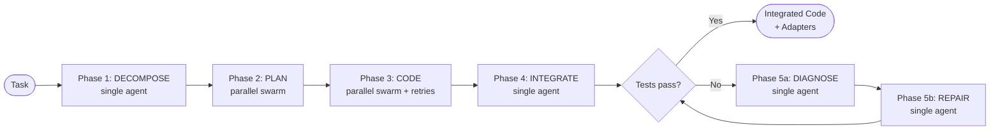

  

<h1 align="center">Rune</h1>

  SoTA-level coding performance from a local SLM, 
  achieved by encoding experience into weight-space memory.

  
  

---

## Documentation

- **Project docs (GitHub Pages)**: https://elixirtrials.github.io/rune/

---

## Abstract

Rune encodes coding trajectories into LoRA adapters so that a local Small Language Model accumulates procedural knowledge across sessions — debugging patterns, project conventions, execution feedback — in weight space rather than context tokens. The system implements a 5-phase template-driven pipeline (decompose → plan → code → integrate → diagnose/repair), parallel swarm orchestration, a Doc-to-LoRA hypernetwork for single-forward-pass adapter generation, TIES/DARE merging for adapter evolution, and a flat adapter registry with lineage tracking. The codebase includes 433+ tests, an end-to-end pipeline exercising all phases, a coding benchmark evaluation framework (HumanEval+, MBPP+, BigCodeBench), a GitHub training data mining pipeline, and inference providers for Transformers, llama.cpp, Ollama, and vLLM. The pipeline runner defaults to Qwen 2.5 Coder 1.5B (`--base-model-id`); benchmarking and evaluation scripts default to Gemma 2 2B (`google/gemma-2-2b-it`). The production target is Qwen 2.5 Coder 7B. GPU fine-tuning and benchmarking are the current priorities.

---

## Motivation

Every coding agent that operates through in-context prompting faces the same ceiling: the context window. Inject enough code, tests, error messages, and documentation to be genuinely useful, and you exhaust the window. The only alternatives are truncation (losing history) or expensive retrieval (finding relevant text, not learned procedures). Neither addresses the underlying issue. Truncation discards context that was hard to produce. Retrieval adds latency and retrieves documents, not competence.

Retrieval-augmented generation partially mitigates the problem by locating relevant documents at query time. But retrieval finds text that describes how something works — it does not encode the procedural knowledge of having done it. A senior developer does not need to retrieve documentation each time they fix a null pointer exception in a pattern they have resolved a hundred times before. That knowledge lives in their mental model, not in a document index. The difference is between declarative memory (knowing that something is true) and procedural memory (knowing how to do something). Current retrieval systems optimize for the former.

Rune proposes a different substrate for memory: model weights. A LoRA adapter is a pair of low-rank matrices that additively shift the behavior of a frozen base model without modifying it. If a coding trajectory — the sequence of code attempts, execution results, errors, and corrections that led to a working solution — can be compressed into a LoRA adapter, then that experience becomes reusable across sessions, composable with other experiences, and independent of context window size. The parametric memory hypothesis is that this compression is possible and that the resulting adapters transfer meaningfully to similar future tasks.

The practical consequence, if the hypothesis holds, is that a Small Language Model running locally on consumer hardware could accumulate coding competence over time rather than forgetting it between sessions. Each task solved makes the system marginally better at the next similar task. The adapter library grows. The quality of code generated for familiar patterns improves. This is qualitatively different from scaling context — it is the model updating its behavior in a targeted, reversible, composable way.

---

## Approach

Rune's core mechanism is a Doc-to-LoRA hypernetwork [1] adapted for coding trajectories. The original Doc-to-LoRA work from Sakana AI demonstrates that a Perceiver-style encoder can map an input document directly to LoRA weight matrices via a single forward pass — approximately distilling the document into the adapter without gradient descent at inference time. Rune extends this in three directions:

**1. Procedural knowledge encoding.** Doc-to-LoRA was validated on factual recall and needle-in-a-haystack tasks. Coding trajectories have a different structure: they are sequences of attempts, failures, error messages, and corrections. Rune proposes to train the hypernetwork on this trajectory format, encoding not just what to do but the corrective reasoning that led there. This is a qualitatively different input modality — whether the same Perceiver-style architecture handles it without modification is the first open question.

**2. Recursive refinement.** The original Doc-to-LoRA is one-shot — a single forward pass over a document produces the adapter. Rune's agent generates code, executes it in a sandbox, observes the result, and iterates. The trajectory grows richer with each attempt before distillation. The hypothesis is that richer trajectories produce higher-quality adapters that generalize better — that the correction steps are signal, not noise.

**3. Compositional memory through the Evolution Operator.** Doc-to-LoRA produces a single adapter intended to replace context for a given document. Rune builds a library: each solved task produces an adapter, and a hierarchical composition mechanism (the Evolution Operator) allows adapters to be merged, pruned, and promoted based on empirical fitness scores. Memory accumulates and compounds rather than being replaced.

The weight update for a single LoRA adapter follows `ΔW = BA`, where `B` and `A` are low-rank matrices (rank `r << d`). This structure makes adapters parameter-efficient: at rank 64 on a 7B model, a full set of adapter weights is approximately 50-200 MB depending on which weight matrices are targeted. This is small enough to store, version, and load hundreds of adapters without approaching filesystem limits.

### Adapter Scaling: The Critical Parameter

A key finding from Bayesian optimization (200 trials across 5 diverse coding tasks) is that **adapter influence scaling is the single most important parameter** for making hypernetwork-generated adapters useful. Sakana's original Doc-to-LoRA applies the full scaling factor (`lora_alpha`, approximately 45.25x for their checkpoint), which works for factual recall but causes degenerate repetition on coding trajectories. Optimization found that attenuating the adapter to ~0.075x of its raw influence produces the best results — strong enough to inject domain context, weak enough not to override the base model's code generation capabilities.

This insight shapes the entire system design: the adapter is not a replacement for the model's knowledge but a contextual nudge. Three bugs were found and fixed in the Sakana D2L → PEFT conversion path (`combine_lora` bias handling, alpha scaling formula, module path prefixes) that were masked at full scaling but became visible at the correct attenuated scale.

Additional optimization findings:
- **Per-task calibration** improves results: a 5-trial scaling sweep (0.5x–1.5x around the base scaling) before each task adapts the influence strength to task complexity
- **Temperature 0.3** with mild repetition penalty (1.1) balances consistency with diversity
- Code-first prompt styles (skeleton, must-include) outperform open-ended prompts
- Full-context trajectories (including error traces and corrections) produce better adapters than minimal summaries

### Two-Stage Training Pipeline

The adapter pipeline has two complementary training paths:

1. **QLoRA bootstrapping** (Stage 1): Gradient descent fine-tuning on NF4-quantized base model using coding trajectories formatted as SFT chat messages. Slow (minutes per adapter) but high quality. Uses DeltaCoder warm-start (`danielcherubini/Qwen3.5-DeltaCoder-9B`) for convergence acceleration and inherited GDN-aware target module coverage. Produces the training corpus for Stage 2.

2. **Hypernetwork generation** (Stage 2): Single forward pass through `DocToLoraHypernetwork` generates rank-8 LoRA weights in milliseconds. This is the production path — used within the pipeline retry loop to inject per-subtask context without prompt stuffing. The hypernetwork is trained to approximate Stage 1's output.

Once the hypernetwork is trained, QLoRA's ongoing role shrinks to producing occasional high-value adapters for tasks where the hypernetwork's approximation is insufficient, which feed back into periodic retraining.

---

## Architecture Overview

Rune's architecture consists of three interacting subsystems: the 5-phase pipeline, the adapter registry with evolutionary lifecycle, and the inference provider layer.

### The 5-Phase Pipeline

A coding task flows through five sequential phases. Phases 2 and 3 run as parallel swarms of agents; phases 1, 4, and 5 run single-agent. Each phase is driven by a Jinja2 template that renders the trajectory/prompt, a hypernetwork H() that optionally generates an adapter, and an inference provider that produces the output. The recursive generate-execute-reflect loop happens *within* each phase via per-phase iteration with early stopping.

- **DECOMPOSE** — Breaks the project into subtasks (`decompose.j2`, `prompt_decompose.j2`, `prompt_decompose_concise.j2`)
- **PLAN** — Generates an architecture plan per subtask in parallel (`plan.j2`, `prompt_plan.j2`)
- **CODE** — Produces working code per subtask with retry on failure (`code.j2`, `code_retry.j2`, `code_continue.j2`, `prompt_code.j2`, `prompt_code_retry.j2`, `prompt_code_continue.j2`)
- **INTEGRATE** — Merges all subtask outputs into a coherent codebase (`integrate.j2`, `prompt_integrate.j2`, `prompt_integrate_retry.j2`)
- **DIAGNOSE/REPAIR** — Two-step failure recovery. Diagnose: error context in prompt, domain knowledge in adapter → model produces a concise fix instruction. Repair: the model's own diagnosis becomes `fix_guidance` in the prompt, domain stays in the adapter → produces fixed code. This separation avoids prompt-adapter tension where error details and domain context compete for model attention. (`diagnose.j2`, `prompt_diagnose.j2`, `code_repair.j2`, `prompt_code_repair.j2`)

Entry points: `scripts/rune_runner.py` (single pipeline run), `scripts/swarm.py` (multi-agent orchestration with training and evolution).

### The Adapter Registry

Adapters are stored in a flat structure indexed by `task_type`, `generation`, and `parent_ids` for lineage tracking. There is no hierarchical project/domain/task tree — instead, the registry supports querying by task type, fitness ranking, lineage walking, and deduplication by training task hash.

Each `AdapterRecord` tracks: `id`, `version`, `task_type`, `base_model_id`, `rank`, `file_path`, `file_hash`, `file_size_bytes`, `pass_rate`, `fitness_score`, `source`, `session_id`, `parent_ids`, `generation`, `training_task_hash`, `agent_id`. Write-once enforcement prevents overwriting existing adapters (`AdapterAlreadyExistsError`). Metadata fields like `fitness_score` and `is_archived` are mutable; weight files are immutable.

The evolution operator (`scripts/swarm_evolution.py`) periodically merges top adapters per task type using TIES or DARE merging, archives low-fitness adapters, and tracks generational lineage.

### The Inference Layer

Inference is provider-agnostic via the `InferenceProvider` abstract base class with four implementations:

| Provider | Backend | LoRA Support |
|----------|---------|-------------|
| `TransformersProvider` | HuggingFace Transformers | Yes (PEFT) |
| `LlamaCppProvider` | llama.cpp via llama-cpp-python | Model-level |
| `OllamaProvider` | Ollama HTTP API | Base model only |
| `VLLMProvider` | vLLM OpenAI-compatible API | Yes (dynamic loading) |

All providers implement `generate()`, `load_adapter()`, `unload_adapter()`, and `list_adapters()`. The factory (`inference/factory.py`) selects the provider based on configuration. For single-GPU setups, the swarm orchestrator coordinates GPU time-sharing between inference and training via vLLM sleep/wake REST calls.

---

## Theoretical Grounding

Rune's architecture is a synthesis of three published approaches, extended for the coding agent setting.

**Doc-to-LoRA** [1] is the central component. Sakana AI's hypernetwork maps input documents to LoRA weight matrices via a Perceiver-style encoder, achieving near-perfect needle-in-a-haystack accuracy at 4x the base model's native context window without any inference-time gradient descent. The approach is framed as "approximate context distillation" — the hypernetwork learns to compress a document's information into a weight delta that causes the base model to behave as if it had read the document. The key limitation for Rune's purposes is that Doc-to-LoRA was validated on factual recall — documents that state facts — rather than on procedural, trajectory-structured inputs. Rune's primary research question is whether the hypernetwork approach transfers to coding trajectories, and whether the three extensions (procedural encoding, recursive refinement, compositional memory) are necessary for that transfer to be useful.

**S-LoRA** [2] addresses the serving challenge: a single base model must efficiently serve many different LoRA adapters concurrently, without loading and unloading adapters between requests. S-LoRA's Unified Paging mechanism manages adapter weights alongside KV cache tensors in a single GPU memory pool, and custom CUDA kernels handle heterogeneous batch LoRA computation — computing different adapter transforms for different items in the same batch. S-LoRA demonstrated "orders of magnitude" more concurrent adapters per GPU than naive PEFT loading. These techniques have been absorbed into vLLM's adapter serving infrastructure, which Rune uses directly rather than implementing from scratch.

**QLoRA** [3] addresses training memory constraints on consumer GPUs. By quantizing the base model to 4-bit NF4 and backpropagating gradients through the frozen quantized weights into bf16 LoRA adapters, QLoRA demonstrated fine-tuning of 65B models on a single consumer GPU with minimal quality loss. For Rune, QLoRA is essential: without it, a 7B base model in bf16 (~14 GB) leaves insufficient headroom for adapter weights, optimizer states, and activation memory on a typical consumer GPU during training. The NF4 data type (which is information-theoretically optimal for normally distributed weights) and double quantization (which quantizes the quantization constants themselves) significantly reduce the VRAM requirements for training.

---

## Design Principles

- **Local-first.** Rune runs entirely on local hardware. No cloud API dependencies for inference, training, or adapter storage. Your data does not leave your machine.
- **Empirically grounded.** Every architectural choice traces to a published result. When the hypothesis fails, the failure is informative — it narrows the design space for the field.
- **Compositional memory.** Adapters accumulate and compose hierarchically rather than replacing each other. Experience compounds.
- **Security-aware.** Agent-generated code executes in sandboxed containers with no network access and strict resource limits. The agent operates outside the sandbox.
- **Transparent.** All adapter metadata is queryable: what tasks produced it, what fitness score it holds, what base model it targets. No black-box memory.
- **Sovereign AI.** Your models, your weights, your hardware. The adapter library is yours and stored locally.

---

## Hardware

Rune runs on any local machine with a CUDA-capable GPU. The system is designed for local-first operation; no cloud APIs or specialized hardware are required.

**Minimum:** A single CUDA-capable GPU with sufficient VRAM for the chosen base model (for example, approximately 4 GB for a 7B model with QLoRA NF4 quantization). QLoRA is used by default to reduce VRAM requirements, making 7B models practical on consumer GPUs.

**Multi-GPU:** If you have multiple GPUs, Rune supports pipeline parallelism to improve serving throughput. For GPUs connected via PCIe (most consumer setups), pipeline parallelism (`--pipeline-parallel-size N`) is recommended over tensor parallelism. Tensor parallelism requires all-reduce synchronization at every transformer layer — efficient over NVLink (~112 GB/s per direction) but a bottleneck over PCIe (~32 GB/s bidirectional). Additionally, vLLM issue [#21471](https://github.com/vllm-project/vllm/issues/21471) documents TP + LoRA output corruption on consumer GPUs without NVLink; pipeline parallelism is the confirmed working configuration.

The swarm orchestrator defaults to single-GPU operation with sleep/wake time-sharing between inference and training. Multi-GPU setups can dedicate separate GPUs to each role.

---

## Current Status

**Stage:** Alpha (infrastructure complete, GPU fine-tuning and benchmarking in progress)

As of 2026-04-05, the following components are implemented and tested (433+ tests passing):

- **5-phase pipeline** (`scripts/rune_runner.py`) — decompose → plan → code → integrate → diagnose/repair with 18 Jinja2 templates, per-phase iteration, DAG-ordered code execution, and early stopping
- **Swarm orchestration** (`scripts/swarm.py`) — parallel agent execution, training pool, evolution worker, memory watchdog, checkpoint persistence
- **Doc-to-LoRA hypernetwork** (`libs/model-training`) — Perceiver-based `DocToLoraHypernetwork` generating rank-8 LoRA adapters in a single forward pass; Sakana gemma_demo checkpoint for development
- **Adapter registry** (`libs/adapter-registry`) — SQLite + filesystem store with write-once enforcement, lineage tracking, fitness queries, model registry with DeltaCoder warm-start
- **TIES/DARE merging** (`libs/model-training/merging.py`) — evolutionary adapter combination
- **Inference providers** (`libs/inference`) — TransformersProvider, LlamaCppProvider, OllamaProvider, VLLMProvider
- **Sandbox execution** (`libs/shared/sandbox.py`) — SubprocessBackend for isolated code execution
- **D2L training pipeline** (`libs/model-training`) — data preparation, LoRA mining, hypernetwork training, probing
- **GitHub training data mining** (`scripts/mine_github.py`) — mines PRs, issues, and commits from GitHub repositories for hypernetwork training corpus; diff compression, pair extraction, batch mining
- **Coding benchmark evaluation** (`scripts/eval/`) — HumanEval+, MBPP+, BigCodeBench with tiered execution (smoke ~5min, mini ~30min, full ~2hr); supports Transformers and vLLM backends
- **Evaluation** (`libs/evaluation`) — OOD benchmark, fitness scoring, Pass@k metrics, generalization delta
- **GPU devcontainer** (`.devcontainer/`) — CUDA 13.0 runtime with flash-attn, Claude Code, DevPod-ready

**What works:** All components pass unit and integration tests. The e2e test (`scripts/e2e_test.py`) exercises the full pipeline from task through all five phases to adapter storage. The benchmark evaluation framework provides standardized coding task evaluation. The GitHub mining pipeline collects training data from real repositories.

**What's next:** GPU fine-tuning and benchmarking — training the hypernetwork on mined trajectory data, then measuring Pass@1 improvement on HumanEval+/MBPP+/BigCodeBench against baseline. Development uses Gemma 2 2B (`google/gemma-2-2b-it`) for rapid iteration; production target is Qwen 2.5 Coder 7B.

---

## Open Questions

- **Does the hypernetwork produce adapters that improve Pass@1 on real hardware?** The hypernetwork architecture is implemented and tested. The benchmark evaluation framework (HumanEval+, MBPP+, BigCodeBench) is ready for systematic measurement. GPU validation is the current priority.
- **How do TIES/DARE-merged adapters interact across task types?** Merging is implemented and tested for correctness. Whether merged adapters transfer constructively across task types (useful knowledge sharing) or destructively (interference) depends on task distribution correlation and remains an empirical question.
- **What is the minimum adapter corpus size for effective hypernetwork training?** The D2L training pipeline and GitHub mining infrastructure are built. The cold-start question — how many diverse adapters are needed before the hypernetwork generalizes — will be answered by early GPU training runs using mined trajectory data.
- **Does recursive refinement improve adapter quality?** The 5-phase pipeline with diagnose/repair and per-phase iteration is implemented. Whether richer trajectories (more attempts, more error corrections, diagnostic reasoning) produce measurably better adapters than single-pass trajectories is an empirical question for GPU validation.

---

## References

[1] Charakorn et al., "Doc-to-LoRA: Learning to Instantly Internalize Contexts," arXiv:2602.15902, 2026. https://arxiv.org/abs/2602.15902

[2] Sheng et al., "S-LoRA: Serving Thousands of Concurrent LoRA Adapters," arXiv:2311.03285, 2023. https://arxiv.org/abs/2311.03285

[3] Dettmers et al., "QLoRA: Efficient Finetuning of Quantized LLMs," arXiv:2305.14314, 2023. https://arxiv.org/abs/2305.14314

---

## System Components

Rune is structured as a monorepo with services, libraries, and a scripts-based orchestration layer:

| Component | Status | Role |
|-----------|--------|------|
| `scripts/` | Implemented | Fat orchestrator (primary execution path): `rune_runner.py` (5-phase pipeline), `swarm.py` (multi-agent), `swarm_workers.py` (training pool), `swarm_evolution.py` (merging/pruning), `mine_github.py` (training data mining), `e2e_test.py`, `e2e_benchmark.py`, `e2e_inference_smoke.py`, `e2e_training_smoke.py`, `experiment_harness.py` (adapter experiments), `benchmark_challenging.py`, `compare_output.py`, `demo_project.py`, `demo_run.py`, `bootstrap.py` |
| `scripts/eval/` | Implemented | Coding benchmark evaluation: `run_benchmarks.py` (HumanEval+/MBPP+/BigCodeBench), `generate_completions.py`, `config.py` |
| `scripts/optimization/` | Implemented | Bayesian parameter optimization (Optuna TPE): `run_optimization.py` (overnight runner), `scoring.py` (fitness scoring), `task_pool.py` (diverse task sampling), `template_library.py` (prompt/trajectory style variants) |
| `services/rune-agent` | Implemented | LangGraph state graph: generate → execute → reflect → save, with single-iteration mode for outer loop control |
| `services/training-svc` | Implemented | FastAPI service: POST /train/lora, POST /train/hypernetwork, GET /jobs/{id} — all endpoints functional with background job dispatch |
| `services/evolution-svc` | Stubs | FastAPI service with 501 endpoint stubs: /evaluate, /evolve, /promote, /prune. Real evolution logic lives in `scripts/swarm_evolution.py` |
| `services/api-service` | Stubs | FastAPI service with 501 endpoint stubs for /sessions and /adapters routes. Health/ready endpoints work. Database infrastructure exists but business logic not yet implemented |
| `libs/adapter-registry` | Implemented | SQLite + filesystem adapter store with write-once enforcement, fitness queries, lineage tracking |
| `libs/model-training` | Implemented | Hypernetwork, D2L training pipeline, TIES/DARE merging, QLoRA trainer, PEFT utilities |
| `libs/inference` | Implemented | Provider-agnostic interface with Transformers, llama.cpp, Ollama, and vLLM backends |
| `libs/shared` | Implemented | Hardware probe, sandbox, checkpoint DB, template loader (18 Jinja2 templates), Rune data models, storage utils, lazy cache |
| `libs/evaluation` | Implemented | OOD benchmark, Pass@k metrics, fitness scoring, generalization delta |
| `libs/events-py` | Implemented | Event envelope (created/updated/deleted) with typed helpers |

---

## Collaboration

Contributions are welcome. To get started:

1. **Run the tests:** `uv sync --all-extras && uv run pytest` (433+ tests, runs in ~1 minute on CPU)
2. **Follow conventions:** Google docstrings, `ruff` for linting, `mypy` for type checking, `uv` for dependency management
3. **Key entry points:** `scripts/rune_runner.py` (pipeline), `scripts/swarm.py` (orchestrator), `scripts/e2e_test.py` (end-to-end), `scripts/eval/run_benchmarks.py` (benchmarks)

If you are working on hypernetwork training for procedural knowledge, LoRA episodic memory for agents, or local inference/training infrastructure on consumer hardware — this is adjacent territory. Discussion, critique, and GPU validation results are especially valuable at this stage.

Open a thread in [GitHub Discussions](../../discussions) or reach out directly.

---

## License

This project is licensed under the **PolyForm Noncommercial License 1.0.0** (see `LICENSE`), which **does not allow commercial use**.
