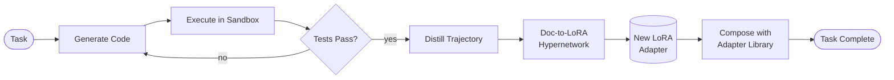
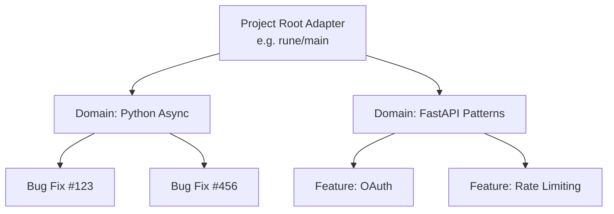
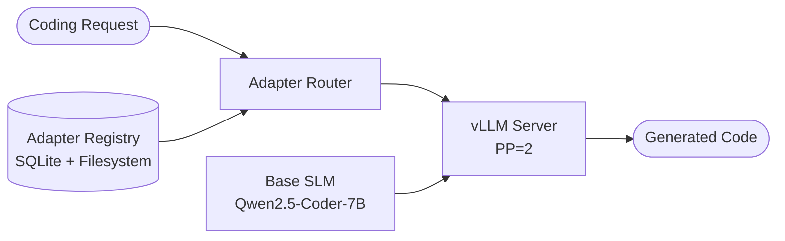

  

# Rune

SoTA-level coding performance from a local SLM, achieved by encoding experience into weight-space memory.

---

---

## Documentation

- **Project docs (GitHub Pages)**: https://elixirtrials.github.io/rune/

---

## Abstract

Current coding agents are bounded by context windows: each session begins fresh, and accumulated procedural knowledge — debugging patterns, project conventions, execution feedback — evaporates when the window closes. Rune hypothesizes that LoRA weight space can serve as persistent episodic memory, encoding what an agent has learned directly into the model's parameters rather than into tokens. The approach centers on a Doc-to-LoRA hypernetwork that converts coding trajectories into composable LoRA adapters in a single forward pass, combined with recursive distillation and a hierarchical adapter library that grows with each solved task. Rune is at the research stage: the architecture is documented, the component design is grounded in published work, and no implementation exists yet — the core hypothesis awaits empirical validation.

---

## Motivation

Every coding agent that operates through in-context prompting faces the same ceiling: the context window. Inject enough code, tests, error messages, and documentation to be genuinely useful, and you exhaust the window. The only alternatives are truncation (losing history) or expensive retrieval (finding relevant text, not learned procedures). Neither addresses the underlying issue. Truncation discards context that was hard to produce. Retrieval adds latency and retrieves documents, not competence.

Retrieval-augmented generation partially mitigates the problem by locating relevant documents at query time. But retrieval finds text that describes how something works — it does not encode the procedural knowledge of having done it. A senior developer does not need to retrieve documentation each time they fix a null pointer exception in a pattern they have resolved a hundred times before. That knowledge lives in their mental model, not in a document index. The difference is between declarative memory (knowing that something is true) and procedural memory (knowing how to do something). Current retrieval systems optimize for the former.

Rune proposes a different substrate for memory: model weights. A LoRA adapter is a pair of low-rank matrices that additively shift the behavior of a frozen base model without modifying it. If a coding trajectory — the sequence of code attempts, execution results, errors, and corrections that led to a working solution — can be compressed into a LoRA adapter, then that experience becomes reusable across sessions, composable with other experiences, and independent of context window size. The parametric memory hypothesis is that this compression is possible and that the resulting adapters transfer meaningfully to similar future tasks.

The practical consequence, if the hypothesis holds, is that a Small Language Model running locally on consumer hardware could accumulate coding competence over time rather than forgetting it between sessions. Each task solved makes the system marginally better at the next similar task. The adapter library grows. The quality of code generated for familiar patterns improves. This is qualitatively different from scaling context — it is the model updating its behavior in a targeted, reversible, composable way.

---

## Approach

Rune's core mechanism is a Doc-to-LoRA hypernetwork [1] adapted for coding trajectories. The original Doc-to-LoRA work from Sakana AI demonstrates that a Perceiver-style encoder can map an input document directly to LoRA weight matrices via a single forward pass — approximately distilling the document into the adapter without gradient descent at inference time. Rune extends this in three directions:

**1. Procedural knowledge encoding.** Doc-to-LoRA was validated on factual recall and needle-in-a-haystack tasks. Coding trajectories have a different structure: they are sequences of attempts, failures, error messages, and corrections. Rune proposes to train the hypernetwork on this trajectory format, encoding not just what to do but the corrective reasoning that led there. This is a qualitatively different input modality — whether the same Perceiver-style architecture handles it without modification is the first open question.

**2. Recursive refinement.** The original Doc-to-LoRA is one-shot — a single forward pass over a document produces the adapter. Rune's agent generates code, executes it in a sandbox, observes the result, and iterates. The trajectory grows richer with each attempt before distillation. The hypothesis is that richer trajectories produce higher-quality adapters that generalize better — that the correction steps are signal, not noise.

**3. Compositional memory through the Evolution Operator.** Doc-to-LoRA produces a single adapter intended to replace context for a given document. Rune builds a library: each solved task produces an adapter, and a hierarchical composition mechanism (the Evolution Operator) allows adapters to be merged, pruned, and promoted based on empirical fitness scores. Memory accumulates and compounds rather than being replaced.

The weight update for a single LoRA adapter follows `ΔW = BA`, where `B` and `A` are low-rank matrices (rank `r << d`). This structure makes adapters parameter-efficient: at rank 64 on a 7B model, a full set of adapter weights is approximately 50-200 MB depending on which weight matrices are targeted. This is small enough to store, version, and load hundreds of adapters without approaching filesystem or VRAM limits.

---

## Architecture Overview

Rune's architecture consists of three interacting components: the recursive code generation loop, the adapter hierarchy, and the serving layer.

### The Recursive Loop

The agent begins with a task and a set of candidate adapters selected from the adapter library. It generates code, executes it in an isolated sandbox, and evaluates the result. If tests fail, the trajectory is fed back into the generation step. When tests pass — or after a maximum attempt count — the complete trajectory is distilled into a new LoRA adapter by the Doc-to-LoRA hypernetwork, and that adapter is composed into the library.

The three Rune extensions to Doc-to-LoRA are visible in this loop: procedural trajectories enter the hypernetwork (not factual documents), the generate-execute-reflect cycle produces recursive refinement before distillation, and the Compose step merges the new adapter with the existing library rather than replacing it. The sandbox is network-isolated and resource-constrained — agent-generated code cannot escape the container.

### The Adapter Hierarchy

Adapters are organized in a three-level hierarchy: a project root adapter encodes high-level conventions and patterns, domain adapters encode task-type knowledge (async Python patterns, FastAPI idioms), and task-specific adapters encode solutions to individual problems. When a new task arrives, the adapter router selects the most relevant adapters at each level and loads them into the serving layer.

The Evolution Operator manages this hierarchy: periodically evaluating adapter fitness on held-out tests, promoting high-performing adapters upward in the hierarchy, pruning low-performing ones, and merging adapters that have overlapping coverage. This lifecycle means the adapter library improves continuously as the agent works on more tasks. Adapters are stored as versioned `.safetensors` files on the local filesystem with metadata in SQLite; the registry is queryable without loading weights into GPU memory.

### The Serving Architecture

The base Small Language Model (SLM) runs in a vLLM server configured for pipeline parallelism across two GPUs. The adapter router queries the adapter registry — a SQLite metadata store — selects the relevant adapters for the current task, and loads them dynamically into the vLLM serving process. This design follows S-LoRA's unified paging approach [2], which manages adapter weights and KV cache tensors in a shared GPU memory pool, enabling concurrent serving of many adapters from a single base model without reloading weights.

The serving layer is intentionally separated from training: when the hypernetwork or fine-tuning jobs require GPU resources, the serving process yields GPUs via a lease mechanism rather than competing for VRAM. Pipeline parallelism splits the model layers across both GPUs and passes activations at layer boundaries — the correct strategy for GPUs connected via PCIe rather than NVLink.

---

## Theoretical Grounding

Rune's architecture is a synthesis of three published approaches, extended for the coding agent setting.

**Doc-to-LoRA** [1] is the central component. Sakana AI's hypernetwork maps input documents to LoRA weight matrices via a Perceiver-style encoder, achieving near-perfect needle-in-a-haystack accuracy at 4x the base model's native context window without any inference-time gradient descent. The approach is framed as "approximate context distillation" — the hypernetwork learns to compress a document's information into a weight delta that causes the base model to behave as if it had read the document. The key limitation for Rune's purposes is that Doc-to-LoRA was validated on factual recall — documents that state facts — rather than on procedural, trajectory-structured inputs. Rune's primary research question is whether the hypernetwork approach transfers to coding trajectories, and whether the three extensions (procedural encoding, recursive refinement, compositional memory) are necessary for that transfer to be useful.

**S-LoRA** [2] addresses the serving challenge: a single base model must efficiently serve many different LoRA adapters concurrently, without loading and unloading adapters between requests. S-LoRA's Unified Paging mechanism manages adapter weights alongside KV cache tensors in a single GPU memory pool, and custom CUDA kernels handle heterogeneous batch LoRA computation — computing different adapter transforms for different items in the same batch. S-LoRA demonstrated "orders of magnitude" more concurrent adapters per GPU than naive PEFT loading. These techniques have been absorbed into vLLM's adapter serving infrastructure, which Rune uses directly rather than implementing from scratch.

**QLoRA** [3] addresses the training constraint imposed by 24 GB per-GPU VRAM. By quantizing the base model to 4-bit NF4 and backpropagating gradients through the frozen quantized weights into bf16 LoRA adapters, QLoRA demonstrated fine-tuning of 65B models on a single consumer GPU with minimal quality loss. For Rune, QLoRA is essential: without it, a 7B base model in bf16 (~14 GB) leaves insufficient headroom for adapter weights, optimizer states, and activation memory on a 24 GB GPU during training. The NF4 data type (which is information-theoretically optimal for normally distributed weights) and double quantization (which quantizes the quantization constants themselves) are not optional — they are required for the hardware configuration to be viable.

---

## Design Principles

- **Local-first.** Rune runs entirely on local hardware. No cloud API dependencies for inference, training, or adapter storage. Your data does not leave your machine.
- **Empirically grounded.** Every architectural choice traces to a published result. When the hypothesis fails, the failure is informative — it narrows the design space for the field.
- **Compositional memory.** Adapters accumulate and compose hierarchically rather than replacing each other. Experience compounds.
- **Security-aware.** Agent-generated code executes in sandboxed containers with no network access and strict resource limits. The agent operates outside the sandbox.
- **Transparent.** All adapter metadata is queryable: what tasks produced it, what fitness score it holds, what base model it targets. No black-box memory.
- **Sovereign AI.** Your models, your weights, your hardware. The adapter library is yours and stored locally.

---

## Hardware Requirements

Rune targets the following local hardware configuration:

| Component | Specification |
|-----------|--------------|
| GPU | 2x NVIDIA RTX 4090 (24 GB VRAM each, 48 GB total) |
| GPU Interconnect | CXL (cache-coherent memory pooling) |
| CPU | AMD Threadripper 7960X |
| CUDA | 12.8+ (cu128) |
| PyTorch | 2.9+ (nightly, cu128 wheels) |
| Quantization | QLoRA (NF4 4-bit) — required for 7B+ models on 24 GB |

A single RTX 4090 is sufficient to evaluate inference-only workloads. Simultaneously training the hypernetwork and serving adapters requires both GPUs. Pipeline parallelism (`--pipeline-parallel-size 2`, `--tensor-parallel-size 1`) is the required multi-GPU configuration: the RTX 4090 lacks NVLink, and tensor parallelism requires all-reduce operations at every transformer layer — prohibitively expensive over a PCIe interconnect. CXL provides cache-coherent memory pooling across the two GPUs, which is relevant for the adapter registry and coordination between serving and training processes.

Hardware validation is the first project milestone: before any hypothesis testing, both GPUs must be recognized by CUDA, PyTorch nightly cu128 must complete a forward and backward pass without segfault, and vLLM must serve the base model via pipeline parallelism without tensor parallelism corruption.

Note on tensor parallelism: the `--tensor-parallel-size 2` option is explicitly excluded. Tensor parallelism requires all-reduce operations across GPUs at every transformer layer boundary. Without NVLink or a high-bandwidth interconnect, this becomes a severe bottleneck over PCIe (~32 GB/s vs NVLink's ~112 GB/s per direction) and can cause NCCL errors or OOM failures. Pipeline parallelism is the correct choice for this hardware configuration.

---

## Current Status

**Stage:** Research / Pre-implementation

Rune is a documented architecture proposal, not a working system. As of 2026-03-02:

- No implementation exists
- The core hypothesis — that Doc-to-LoRA can encode coding trajectories into reusable LoRA adapters — has not been empirically validated
- The architecture synthesizes prior work (Doc-to-LoRA, S-LoRA, QLoRA) but adapter composition has not been demonstrated for coding tasks

The project is structured so that early phases validate the hypothesis before infrastructure is built. Phase 0 validates the hardware environment and confirms vLLM pipeline parallelism works correctly. Phase 1 tests the core hypothesis with a measurable gate: if the Doc-to-LoRA approach does not produce adapters that improve Pass@1 on held-out coding tasks by at least 5%, the approach is revised before the serving infrastructure is built. If the hypothesis fails, the architecture documentation still stands as a concrete proposal that others can test, extend, or refute.

The architecture is detailed enough to implement. The open question is whether the hypothesis holds.

---

## Open Questions

- **Can Doc-to-LoRA encode procedural coding knowledge?** The hypernetwork was validated on factual recall. Coding trajectories have a different structure — sequential attempts, error messages, corrections. Does the same Perceiver-style architecture generalize to this input format, or does it require architectural modifications to handle trajectory-shaped inputs?
- **Does recursive refinement improve adapter quality?** The baseline is one-shot distillation: a single forward pass over a complete trajectory. Does the iterative generate-execute-reflect loop produce richer trajectories that yield measurably better adapters, or is the marginal improvement small enough that one-shot is sufficient?
- **How do composed adapters interact?** LoRA adapters for different tasks operate in different subspaces of the weight matrix. When composed additively, do they interact constructively (useful transfer across task types) or destructively (interference that degrades performance on both tasks)? The answer depends on how correlated the task distributions are and how the adapter ranks are chosen.
- **What is the minimum adapter corpus size for hypernetwork training?** The hypernetwork requires a diverse corpus of pre-trained LoRA adapters as training data — a cold-start problem. How many adapters are needed before the hypernetwork produces useful outputs? This determines the feasibility timeline for the hypernetwork component specifically.

---

## References

[1] Charakorn et al., "Doc-to-LoRA: Learning to Instantly Internalize Contexts," arXiv:2602.15902, 2026. https://arxiv.org/abs/2602.15902

[2] Sheng et al., "S-LoRA: Serving Thousands of Concurrent LoRA Adapters," arXiv:2311.03285, 2023. https://arxiv.org/abs/2311.03285

[3] Dettmers et al., "QLoRA: Efficient Finetuning of Quantized LLMs," arXiv:2305.14314, 2023. https://arxiv.org/abs/2305.14314

---

## System Components

Rune is structured as a monorepo with four new services and two extended libraries:

| Component | Status | Role |
|-----------|--------|------|
| `services/rune-agent` | New | Recursive code generation loop (LangGraph), sandbox tool integration, adapter selection |
| `services/lora-server` | New | vLLM subprocess serving base model with dynamic LoRA adapter loading |
| `services/training-svc` | New | Async hypernetwork training and LoRA fine-tuning jobs |
| `services/evolution-svc` | New | Adapter fitness evaluation, lifecycle management, pruning, and promotion |
| `libs/adapter-registry` | New | Adapter metadata (SQLite), versioned `.safetensors` files on local filesystem |
| `libs/model-training` | Extend | PEFT utilities, hypernetwork model definition |
| `services/api-service` | Extend | REST API adding session and adapter registry routes |

The build order follows component dependencies: `adapter-registry` first (no dependencies), then `lora-server` (unblocks all agent work), then `model-training` extensions, `api-service` extensions, `rune-agent`, `evolution-svc`, `training-svc`, and finally the hypernetwork (requires a corpus of pre-trained adapters). This ordering ensures the core hypothesis can be tested — with direct LoRA fine-tuning — before the hypernetwork component is built.

---

## Collaboration

Rune is at the research stage — there is no working code to contribute to yet. But if you are working on hypernetwork training for procedural knowledge, LoRA episodic memory for agents, or local inference and training infrastructure on consumer hardware, this is adjacent territory. Discussion, critique, and related work are welcome.

Open a thread in [GitHub Discussions](../../discussions) or reach out directly. The architecture is documented in detail in `.planning/` — the design decisions, hardware constraints, and open questions are all available for review.

The most useful form of collaboration at this stage is critique: identifying flaws in the architectural reasoning, pointing to prior work that addresses the open questions, or sharing results from related experiments. Code contributions will become relevant once the core hypothesis is validated and implementation begins.
