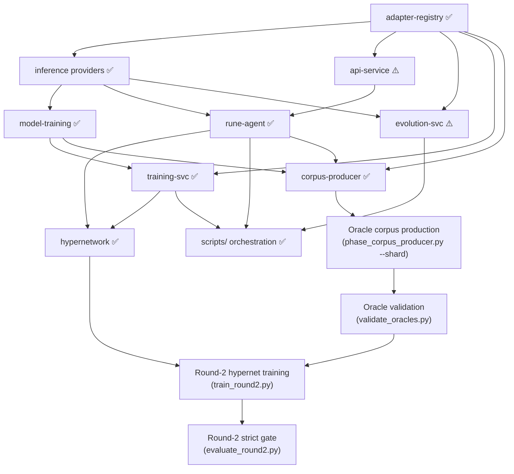

# Build Order

This appendix details the recommended component build order derived from architecture research. The order is determined by dependency analysis — each component is built only after its dependencies exist. The implementation plan phases reference this appendix for the detailed dependency chain.

| Step | Component | Status | Depends On | What It Unblocks |
|------|-----------|--------|------------|-----------------|
| 1 | `libs/adapter-registry` | ✅ Implemented | Nothing | All components that store or retrieve adapters |
| 2 | `services/lora-server` | 🔄 Replaced | adapter-registry | Replaced by `libs/inference` providers (TransformersProvider, LlamaCppProvider, OllamaProvider, VLLMProvider) |
| 3 | `libs/model-training` (extend) | ✅ Implemented | inference providers | Hypernetwork, D2L pipeline, TIES/DARE merging, QLoRA trainer |
| 4 | `services/api-service` (extend) | ⚠️ Stubs | adapter-registry | REST API for adapter management (domain endpoints return 501; health checks work) |
| 5 | `services/rune-agent` | ✅ Implemented | inference, api-service, sandbox | LangGraph state graph; 5-phase pipeline in scripts/rune_runner.py |
| 6 | `services/evolution-svc` | ⚠️ Partial | adapter-registry, inference | REST stubs; evolution logic in scripts/swarm_evolution.py |
| 7 | `services/training-svc` | ✅ Implemented | adapter-registry, model-training | POST /train/lora, POST /train/hypernetwork, GET /jobs/{id} |
| 8 | Hypernetwork | ✅ Implemented | training-svc, adapter corpus | DocToLoraHypernetwork + D2L training pipeline |
| — | `scripts/` orchestration | ✅ Implemented | All above | rune_runner.py, swarm.py, swarm_workers.py, swarm_evolution.py |
| 9 | `libs/corpus-producer` | ✅ Implemented | model-training, rune-agent, adapter-registry | 25-bin oracle corpus generation (4 phases × 6 benchmarks + `diagnose_pooled`); `oracle_<bin_key>` adapter IDs |
| 10 | Oracle corpus production | ✅ Runnable | corpus-producer | Multi-GPU via `scripts/phase_corpus_producer.py --shard IDX/TOTAL --cuda-visible-devices DEVICES`; produces 25 oracle adapters registered as `oracle_<bin_key>` |
| 11 | Oracle validation | ✅ Runnable | Oracle corpus | `scripts/validate_oracles.py` — asserts ≥ 3% Pass@1 improvement vs bare base on each oracle's bin benchmark |
| 12 | Round-2 hypernetwork training | ✅ Implemented | Oracle corpus + round-1 hypernet | `scripts/train_round2.py` — functional-LoRA teacher, KL+CE loss, `OracleAdapterCache` (LRU max 4), startup gate (`min_oracle_coverage=0.8`); produces `round2_<uuid[:8]>` adapter |
| 13 | Round-2 strict gate | ✅ Implemented | Round-2 adapter | `scripts/evaluate_round2.py` — `evaluate_round2_gate`: ≥ 4/6 benchmarks ≥ 2.0% Pass@1, no regression > 1.0%; exit 0 PASS, 1 FAIL |

## Dependency Graph

