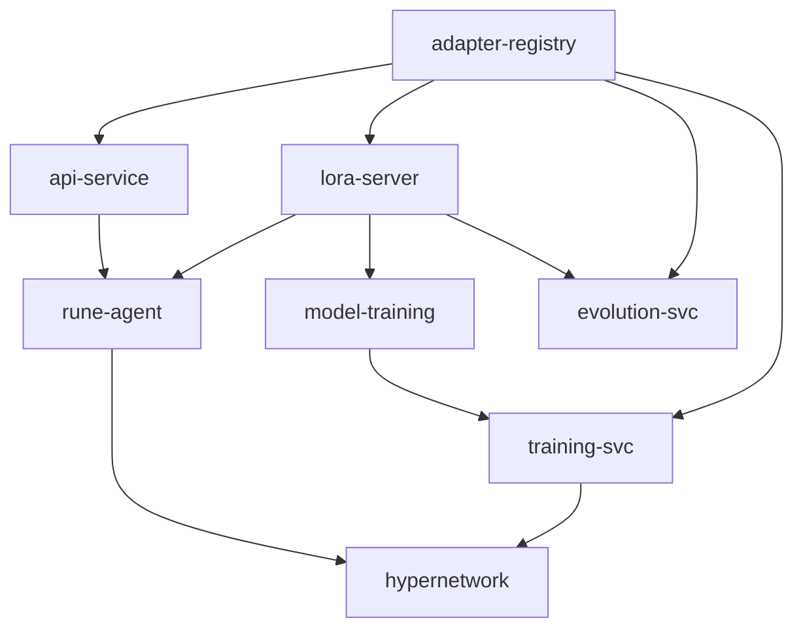

# Build Order

This appendix details the recommended component build order derived from architecture research. The order is determined by dependency analysis — each component is built only after its dependencies exist. The implementation plan phases reference this appendix for the detailed dependency chain.

| Step | Component | Depends On | What It Unblocks |
|------|-----------|------------|-----------------|
| 1 | `libs/adapter-registry` | Nothing | All components that store or retrieve adapters |
| 2 | `services/lora-server` | adapter-registry | All agent work; hypothesis testing; serving with dynamic LoRA loading |
| 3 | `libs/model-training` (extend existing) | lora-server | training-svc; fine-tuning pipeline |
| 4 | `services/api-service` (extend existing) | adapter-registry | REST API for adapter management |
| 5 | `services/rune-agent` | lora-server, api-service, sandbox | Core recursive loop; end-to-end task-to-adapter path |
| 6 | `services/evolution-svc` | adapter-registry, lora-server | Adapter lifecycle management; fitness-based pruning and promotion |
| 7 | `services/training-svc` | adapter-registry, model-training | LoRA fine-tuning jobs; hypernetwork training |
| 8 | Hypernetwork | training-svc, adapter corpus (from rune-agent) | Doc-to-LoRA inference-time adapter synthesis |

## Dependency Graph

