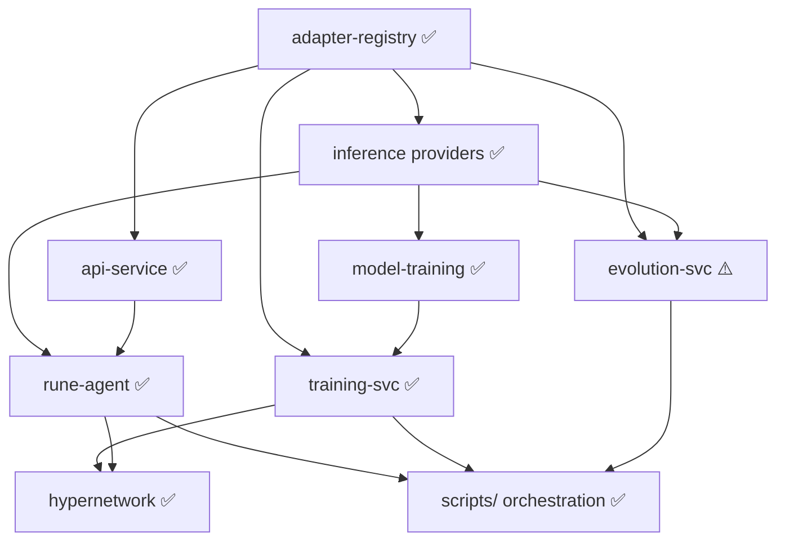

# Build Order

This appendix details the recommended component build order derived from architecture research. The order is determined by dependency analysis — each component is built only after its dependencies exist. The implementation plan phases reference this appendix for the detailed dependency chain.

| Step | Component | Status | Depends On | What It Unblocks |
|------|-----------|--------|------------|-----------------|
| 1 | `libs/adapter-registry` | ✅ Implemented | Nothing | All components that store or retrieve adapters |
| 2 | `services/lora-server` | 🔄 Replaced | adapter-registry | Replaced by `libs/inference` providers (TransformersProvider, LlamaCppProvider, OllamaProvider, VLLMProvider) |
| 3 | `libs/model-training` (extend) | ✅ Implemented | inference providers | Hypernetwork, D2L pipeline, TIES/DARE merging, QLoRA trainer |
| 4 | `services/api-service` (extend) | ✅ Implemented | adapter-registry | REST API for adapter management |
| 5 | `services/rune-agent` | ✅ Implemented | inference, api-service, sandbox | LangGraph state graph; 4-phase pipeline in scripts/rune_runner.py |
| 6 | `services/evolution-svc` | ⚠️ Partial | adapter-registry, inference | REST stubs; evolution logic in scripts/swarm_evolution.py |
| 7 | `services/training-svc` | ✅ Implemented | adapter-registry, model-training | POST /train/lora, POST /train/hypernetwork, GET /jobs/{id} |
| 8 | Hypernetwork | ✅ Implemented | training-svc, adapter corpus | DocToLoraHypernetwork + D2L training pipeline |
| — | `scripts/` orchestration | ✅ Implemented | All above | rune_runner.py, swarm.py, swarm_workers.py, swarm_evolution.py |

## Dependency Graph

