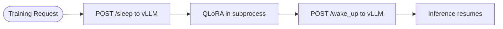

# Monorepo Service Mapping

## Overview

Rune is built within an existing monorepo that provides shared infrastructure (event system, API scaffolding, model training utilities, data pipeline). This document maps each new Rune component to its position in the monorepo, identifies which existing services it extends or runs alongside, and names the specific integration points.

For the component build order and dependency chain, see [Build Order](../appendices/build-order.md).

---

## Service Mapping

### New Services

| Rune Service | Path | Extends / Runs Alongside | Integration Points |
|-------------|------|--------------------------|-------------------|
| `rune-agent` | `services/rune-agent/` | LangGraph state graph (generate → execute → reflect) with 4-phase pipeline (decompose → plan → code → integrate) | Consumes `libs/adapter-registry` for adapter selection; uses `libs/inference` providers for generation; uses `libs/events-py` for event publishing; manages sandbox containers via `libs/shared` |
| `training-svc` | `services/training-svc/` | Extends `libs/model-training` (FastAPI) | Consumes PEFT utilities and hypernetwork from `model-training`; reads adapter corpus from `adapter-registry`; coordinates GPU via vLLM sleep/wake REST calls managed by `scripts/swarm_workers.py` |
| `evolution-svc` | `services/evolution-svc/` | FastAPI stubs; primary logic in `scripts/swarm_evolution.py` | Reads adapter metadata from `adapter-registry`; evaluates adapter fitness using held-out test sets; writes promotion/pruning events via `libs/events-py` |

### New Libraries

| Rune Library | Path | Extends / New | Consumers |
|-------------|------|---------------|-----------|
| `adapter-registry` | `libs/adapter-registry/` | New (implemented) | `rune-agent`, `training-svc`, `evolution-svc`, `api-service` |

### Extended Existing Components

| Component | Path | What Changes |
|-----------|------|-------------|
| `model-training` | `libs/model-training/` | Hypernetwork (DocToLoraHypernetwork), D2L training pipeline (d2l_train, d2l_data, d2l_probe, d2l_config, d2l_lora, d2l_prep, d2l_mining), TIES/DARE merging (merging.py), QLoRA trainer, PEFT utilities, Sakana D2L integration |
| `api-service` | `services/api-service/` | Add REST routes: `/adapters` (registry CRUD), `/sessions` (agent session state); new SQLModel tables for session tracking |
| `inference` | `libs/inference/` | Provider-agnostic interface (InferenceProvider ABC) with TransformersProvider, LlamaCppProvider, OllamaProvider, VLLMProvider backends and factory for configuration-based selection |
| `shared` | `libs/shared/` | Hardware probe, sandbox (SubprocessBackend), checkpoint DB, template loader, Rune data models (CodingSession, SwarmConfig, PipelinePhase), storage utils |
| `evaluation` | `libs/evaluation/` | OOD benchmark, fitness scoring, Pass@k metrics, generalization delta |

---

## Integration Point Details

### adapter-registry (dependency root)

Every Rune component depends on the adapter registry. It provides two interfaces:

| Interface | Protocol | Consumers |
|-----------|----------|-----------|
| Python API (`adapter_registry.registry.AdapterRegistry`) | Direct import (in-process) | `rune-agent`, `training-svc`, `evolution-svc` |
| REST API (via `api-service`) | HTTP | External tools, UI, monitoring |

The registry owns the SQLite database and the filesystem adapter store. Key exceptions: `AdapterAlreadyExistsError`, `AdapterNotFoundError`. See [Adapter Storage](adapter-storage.md) for schema and path conventions.

### GPU Coordination (vLLM sleep/wake)

GPU coordination uses vLLM sleep/wake REST calls managed by `scripts/swarm_workers.py`. When a training job needs the GPU, the worker puts vLLM to sleep, runs QLoRA in a subprocess, then wakes vLLM:



See [GPU Strategy](multi-gpu-strategy.md) for the full GPU coordination protocol.

### rune-agent <-> inference providers

The agent uses the `InferenceProvider` interface from `libs/inference/` for generation. The provider is selected via configuration-based factory, supporting multiple backends:

| Field | Value |
|-------|-------|
| Interface | `InferenceProvider` ABC (`libs/inference/`) |
| Backends | `TransformersProvider`, `LlamaCppProvider`, `OllamaProvider`, `VLLMProvider` |
| Selection | Factory-based, driven by configuration |
| Concurrency | Single-tenant (one agent session at a time in v1) |

### evolution-svc <-> adapter-registry (lifecycle)

The evolution service reads adapter metadata, evaluates fitness on held-out tests, and writes lifecycle events. Note: evolution logic primarily lives in `scripts/swarm_evolution.py`, not in the service endpoints (which are stubs).

| Operation | Description |
|-----------|-------------|
| Evaluate | Run held-out tests against adapter, compute pass rate |
| Promote | Move high-fitness task adapter to domain level |
| Prune | Mark low-fitness adapters as archived (not deleted — write-once) |
| Merge | Combine overlapping adapters into a new composite adapter |

### scripts/ (fat orchestrator)

The `scripts/` directory is the primary execution layer, collapsing the microservice architecture into single-process orchestration:

| Script | Role |
|--------|------|
| `rune_runner.py` | 4-phase pipeline: decompose → plan → code → integrate |
| `swarm.py` | Multi-agent orchestrator: agents + training pool + evolution + watchdog |
| `swarm_workers.py` | Training pool manager: QLoRA in subprocess, vLLM sleep/wake |
| `swarm_evolution.py` | Evolution worker: TIES/DARE merge, pruning, lineage tracking |
| `e2e_test.py` | End-to-end test exercising full pipeline |
| `bootstrap.py` | Path setup for scripts importing from libs/ |

---

## Existing Services Not Modified

These existing monorepo services are not modified by Rune and continue operating independently:

| Service / Library | Role | Rune Relationship |
|------------------|------|-------------------|
| `libs/shared` | Extended: hardware.py, checkpoint_db.py, sandbox.py, template_loader.py, rune_models.py, storage_utils.py | Consumed by scripts, services, and other libs |
| `libs/evaluation` | Extended: ood_benchmark.py, metrics.py | Used by `evolution-svc` and `scripts/swarm_evolution.py` for fitness evaluation |

---

## Monorepo Layout (Post-Rune)

```
rune/
  scripts/                  # Fat orchestrator layer
    rune_runner.py          # 4-phase pipeline
    swarm.py                # Multi-agent orchestrator
    swarm_workers.py        # Training pool, GPU coordination
    swarm_evolution.py      # TIES/DARE merge, pruning
    e2e_test.py             # End-to-end test
  services/
    api-service/            # REST API with adapter and session routes
    rune-agent/             # LangGraph state graph: generate → execute → reflect
    training-svc/           # LoRA and hypernetwork training jobs (FastAPI)
    evolution-svc/          # Adapter lifecycle endpoints (FastAPI, stubs)
  libs/
    adapter-registry/       # SQLite + filesystem adapter store
    model-training/         # Hypernetwork, D2L pipeline, TIES/DARE, trainer
    inference/              # Provider-agnostic: Transformers, llama.cpp, Ollama, vLLM
    shared/                 # Hardware, sandbox, templates, models, checkpoint DB
    evaluation/             # OOD benchmark, Pass@k, fitness scoring
    events-py/              # Event envelope and helpers
  docs/                     # MkDocs documentation
```
