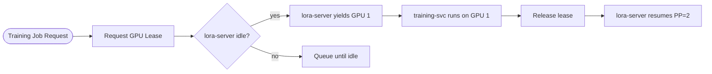

# Monorepo Service Mapping

## Overview

Rune is built within an existing monorepo that provides shared infrastructure (event system, API scaffolding, model training utilities, data pipeline). This document maps each new Rune component to its position in the monorepo, identifies which existing services it extends or runs alongside, and names the specific integration points.

For the component build order and dependency chain, see [Build Order](../appendices/build-order.md).

---

## Service Mapping

### New Services

| Rune Service | Path | Extends / Runs Alongside | Integration Points |
|-------------|------|--------------------------|-------------------|
| `rune-agent` | `services/rune-agent/` | Runs alongside `agent-a-service`, `agent-b-service` | Consumes `libs/adapter-registry` for adapter selection; calls `lora-server` for inference; uses `libs/events-py` for event publishing; manages Docker sandbox containers |
| `lora-server` | `services/lora-server/` | Runs alongside `services/inference` (existing) | Wraps vLLM subprocess (PP=2, TP=1, `--enable-lora`); exposes adapter loading API; coordinates GPU lease with `training-svc` |
| `training-svc` | `services/training-svc/` | Extends `libs/model-training` | Consumes PEFT utilities from `model-training`; reads adapter corpus from `adapter-registry`; acquires GPU lease from `lora-server` for training jobs |
| `evolution-svc` | `services/evolution-svc/` | Runs alongside `services/evaluation` (existing) | Reads adapter metadata from `adapter-registry`; evaluates adapter fitness using held-out test sets; writes promotion/pruning events via `libs/events-py` |

### New Libraries

| Rune Library | Path | Extends / New | Consumers |
|-------------|------|---------------|-----------|
| `adapter-registry` | `libs/adapter-registry/` | New | `rune-agent`, `lora-server`, `training-svc`, `evolution-svc`, `api-service` |

### Extended Existing Components

| Component | Path | What Changes |
|-----------|------|-------------|
| `model-training` | `libs/model-training/` | Add PEFT utilities: QLoRA config helpers, trajectory-to-adapter fine-tuning script, hypernetwork model definition |
| `api-service` | `services/api-service/` | Add REST routes: `/adapters` (registry CRUD), `/sessions` (agent session state); new SQLModel tables for session tracking |
| `inference` | `libs/inference/` | Add adapter-aware inference client that routes requests through `lora-server` with adapter selection headers |

---

## Integration Point Details

### adapter-registry (dependency root)

Every Rune component depends on the adapter registry. It provides two interfaces:

| Interface | Protocol | Consumers |
|-----------|----------|-----------|
| Python API (`adapter_registry.client`) | Direct import (in-process) | `rune-agent`, `training-svc`, `evolution-svc` |
| REST API (via `api-service`) | HTTP | External tools, UI, monitoring |

The registry owns the SQLite database and the filesystem adapter store. See [Adapter Storage](adapter-storage.md) for schema and path conventions.

### lora-server <-> training-svc (GPU lease)

The lora-server and training-svc share the same two GPUs. They coordinate via a GPU lease mechanism:



See [Multi-GPU Strategy](multi-gpu-strategy.md) for the full GPU lease protocol.

### rune-agent <-> lora-server (inference)

The agent sends generation requests to the lora-server with adapter selection metadata. The lora-server loads the requested adapters via vLLM's dynamic LoRA API (S-LoRA unified paging) and returns generated code.

| Field | Value |
|-------|-------|
| Protocol | HTTP (OpenAI-compatible `/v1/completions`) |
| Adapter selection | `X-Adapter-IDs` header or request body field |
| Concurrency | Single-tenant (one agent session at a time in v1) |

### evolution-svc <-> adapter-registry (lifecycle)

The evolution service reads adapter metadata, evaluates fitness on held-out tests, and writes lifecycle events:

| Operation | Description |
|-----------|-------------|
| Evaluate | Run held-out tests against adapter, compute pass rate |
| Promote | Move high-fitness task adapter to domain level |
| Prune | Mark low-fitness adapters as archived (not deleted — write-once) |
| Merge | Combine overlapping adapters into a new composite adapter |

---

## Existing Services Not Modified

These existing monorepo services are not modified by Rune and continue operating independently:

| Service / Library | Role | Rune Relationship |
|------------------|------|-------------------|
| `agent-a-service` | Existing agent service | Rune-agent runs alongside; no direct integration |
| `agent-b-service` | Existing agent service | Rune-agent runs alongside; no direct integration |
| `libs/events-ts` | TypeScript event library | Not used by Rune (Python-only) |
| `libs/shared-ts` | TypeScript shared utilities | Not used by Rune (Python-only) |
| `libs/shared` | Shared utilities | May consume for common config patterns |
| `libs/data-pipeline` | Data pipeline library | Not directly used; may provide dataset utilities later |
| `libs/evaluation` | Evaluation library | Used by `evolution-svc` for test execution harness |

---

## Monorepo Layout (Post-Rune)

```
rune/
  services/
    api-service/          # Extended: +adapter and session routes
    agent-a-service/      # Unchanged
    agent-b-service/      # Unchanged
    rune-agent/           # New: recursive code generation loop
    lora-server/          # New: vLLM serving with dynamic LoRA
    training-svc/         # New: hypernetwork + fine-tuning jobs
    evolution-svc/        # New: adapter lifecycle management
  libs/
    adapter-registry/     # New: SQLite + filesystem adapter store
    model-training/       # Extended: +PEFT utilities, hypernetwork
    inference/            # Extended: +adapter-aware client
    events-py/            # Unchanged (consumed by new services)
    evaluation/           # Unchanged (consumed by evolution-svc)
    shared/               # Unchanged
    shared-ts/            # Unchanged
    events-ts/            # Unchanged
    data-pipeline/        # Unchanged
```
