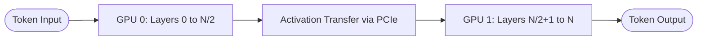
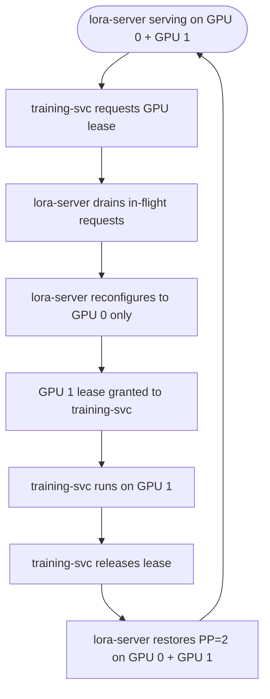

# Multi-GPU Strategy

## Overview

Rune runs on 2x NVIDIA RTX 4090 GPUs (24 GB VRAM each, 48 GB total) connected via CXL. This document specifies the required multi-GPU configuration — pipeline parallelism with PP=2 and TP=1 — explains why tensor parallelism is excluded, and documents the GPU lease mechanism that coordinates concurrent training and serving workloads.

For the services that use these GPUs, see [Monorepo Mapping](monorepo-mapping.md). For the adapter format served by the GPU layer, see [Adapter Storage](adapter-storage.md).

---

## Required Configuration

| Parameter | Value | Rationale |
|-----------|-------|-----------|
| `--pipeline-parallel-size` | 2 | Splits model layers across both GPUs; passes activations at layer boundaries only |
| `--tensor-parallel-size` | 1 | Disabled. See "Why No Tensor Parallelism" below |
| `--enable-lora` | true | Required for dynamic adapter loading via S-LoRA unified paging |
| `--quantization` | awq or gptq (serving) | 4-bit quantized serving for VRAM headroom |
| Base model | Qwen2.5-Coder-7B-Instruct | 7B parameter SLM; fits in 24 GB per GPU with quantization |

### Pipeline Parallelism (PP=2)

Pipeline parallelism splits the transformer layers across GPUs. GPU 0 holds layers 0 through N/2, GPU 1 holds layers N/2+1 through N. During a forward pass, activations are passed once at the layer boundary — a single point-to-point transfer per request, not per layer.

The PCIe bandwidth (~32 GB/s bidirectional) is sufficient for this pattern because the transfer happens once per forward pass at a single layer boundary. Activation tensors at a layer boundary for a 7B model are small relative to the bus bandwidth.

---

## Why No Tensor Parallelism

Tensor parallelism (TP) is explicitly excluded (`--tensor-parallel-size 1`). Three independent factors make TP non-viable on this hardware.

### Factor 1: No NVLink

Tensor parallelism shards individual weight matrices across GPUs and requires all-reduce synchronization at every transformer layer. On NVLink (~112 GB/s per direction), this is fast. On PCIe (~32 GB/s bidirectional), the all-reduce at every layer becomes the bottleneck:

| Interconnect | Bandwidth | All-Reduce Overhead per Layer | Viable for TP? |
|-------------|-----------|-------------------------------|----------------|
| NVLink (A100/H100) | ~112 GB/s per direction | Negligible | Yes |
| PCIe Gen4 (RTX 4090) | ~32 GB/s bidirectional | Significant | No |

The RTX 4090 does not have NVLink. PCIe is the only available interconnect for GPU-to-GPU communication. Pipeline parallelism avoids this bottleneck by transferring activations once at a layer boundary instead of synchronizing at every layer.

### Factor 2: vLLM TP+LoRA Bug (#21471)

vLLM issue [#21471](https://github.com/vllm-project/vllm/issues/21471) documents a confirmed bug where tensor parallelism combined with LoRA adapter serving produces corrupted outputs on consumer GPUs without NVLink. The bug manifests as silently wrong generated text — not crashes or errors — making it particularly dangerous. The corruption is absent under pipeline parallelism (PP=2, TP=1), which is the confirmed working configuration.

### Factor 3: CXL Interconnect Characteristics

The CXL interconnect between the two GPUs provides cache-coherent memory pooling, which benefits CPU-GPU coordination and shared metadata access. However, CXL does not provide the low-latency, high-bandwidth GPU-to-GPU data path that tensor parallelism requires. CXL is designed for memory expansion and coherence, not for the tight synchronization pattern of all-reduce operations.

---

## VRAM Budget

### Serving Mode (PP=2, both GPUs)

| Component | GPU 0 | GPU 1 |
|-----------|-------|-------|
| Base model layers (NF4 4-bit) | ~2 GB | ~2 GB |
| KV cache | ~8-12 GB | ~8-12 GB |
| LoRA adapter weights (S-LoRA paging) | ~1-4 GB | ~1-4 GB |
| vLLM overhead | ~2 GB | ~2 GB |
| **Total** | **~13-20 GB** | **~13-20 GB** |
| **Headroom** | **4-11 GB** | **4-11 GB** |

The 7B model in NF4 quantization is approximately 4 GB total, split across both GPUs. S-LoRA unified paging manages adapter weights alongside KV cache in a shared GPU memory pool, enabling concurrent serving of multiple adapters without per-adapter VRAM reservation.

### Training Mode (single GPU)

| Component | GPU (training) |
|-----------|---------------|
| Base model (NF4 frozen) | ~4 GB |
| LoRA adapter weights (bf16) | ~0.1-0.4 GB |
| Optimizer states (AdamW) | ~0.2-0.8 GB |
| Activations + gradients | ~8-12 GB |
| **Total** | **~12-17 GB** |
| **Headroom** | **7-12 GB** |

QLoRA is required for training: the base model is frozen in NF4 4-bit, and gradients flow through the quantized weights into bf16 LoRA adapter matrices. Without QLoRA, a 7B model in bf16 (~14 GB) leaves insufficient headroom for optimizer states and activations on a 24 GB GPU.

---

## GPU Lease Mechanism

The lora-server (vLLM, PP=2) normally occupies both GPUs for inference. When training-svc needs GPU time for fine-tuning or hypernetwork training, a lease mechanism coordinates the handoff.

### Lease Protocol

### Lease States

| State | GPU 0 | GPU 1 | Serving | Training |
|-------|-------|-------|---------|----------|
| Normal | lora-server (PP layer 0-N/2) | lora-server (PP layer N/2+1-N) | Full PP=2 | Unavailable |
| Training lease | lora-server (single GPU, reduced capacity) | training-svc | Degraded (single GPU, smaller batch) | Active |
| Transitioning | Draining requests | Awaiting release | Paused briefly | Pending |

### Design Decisions

**Why not dedicate one GPU per workload permanently?** At 24 GB per GPU, a permanently split configuration leaves insufficient VRAM for either workload to run optimally. PP=2 serving uses the full 48 GB for KV cache and adapter paging. Training needs a full GPU for activations and optimizer states. Time-sharing via the lease mechanism gives each workload full resources during its active period.

**Why does lora-server yield, not training-svc queue indefinitely?** Inference is latency-sensitive but interruptible between requests. Training jobs run for minutes to hours. The lease mechanism prioritizes training throughput (no VRAM competition) while keeping inference available in degraded mode on the remaining GPU.

**Lease coordination is implemented via a shared state file** at `~/.rune/gpu_lease.json`, protected by file locking. The lora-server polls this file between request batches. The state file contains: `holder` (service name or null), `granted_at` (timestamp), `gpu_id` (which GPU is leased), and `expires_at` (maximum lease duration, default 2 hours).

---

## Hardware Reference

| Component | Specification |
|-----------|--------------|
| GPU | 2x NVIDIA RTX 4090 (Ada Lovelace, sm_89) |
| VRAM per GPU | 24 GB GDDR6X |
| GPU interconnect | CXL (cache-coherent memory pooling) |
| PCIe | Gen4 x16 (~32 GB/s bidirectional) |
| CPU | AMD Threadripper 7960X |
| CUDA | 12.8+ (cu128) |
| PyTorch | 2.9+ (nightly, cu128 wheels) |

CXL provides cache-coherent memory pooling across both GPUs, which benefits the adapter registry (shared metadata access) and coordination between serving and training processes. It does not substitute for NVLink in GPU-to-GPU compute synchronization.
