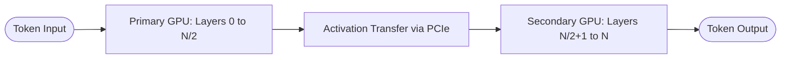
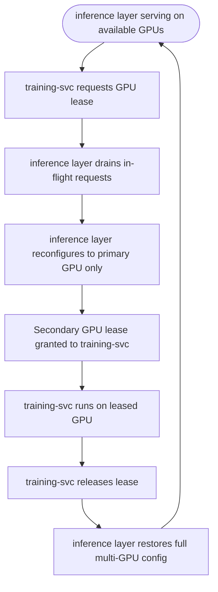

# GPU Strategy

## Overview

Rune is designed to run on any local machine with a CUDA-capable GPU. A single GPU is fully supported. If you have multiple GPUs, Rune supports pipeline parallelism to improve serving throughput and to allow concurrent training and inference workloads.

This document explains the recommended GPU configuration, why pipeline parallelism is preferred over tensor parallelism for consumer hardware, and the GPU lease mechanism that coordinates training and serving.

For the services that use GPUs, see [Monorepo Mapping](monorepo-mapping.md). For the adapter format served by the GPU layer, see [Adapter Storage](adapter-storage.md).

---

## Recommended Configuration

| Parameter | Default | Rationale |
|-----------|---------|-----------|
| `--pipeline-parallel-size` | 1 (single GPU) | Configurable; set to N for N-GPU pipeline parallelism |
| `--tensor-parallel-size` | 1 | Not recommended for consumer GPUs — see below |
| `--enable-lora` | true | Required for dynamic adapter loading via S-LoRA unified paging |
| `--quantization` | awq or gptq (serving) | 4-bit quantized serving for VRAM headroom |
| Base model | Qwen/Qwen3.5-9B | 9B parameter SLM; fits in consumer GPUs with 4-bit quantization |

All parallelism settings are configurable via inference provider configuration (`libs/inference/`) or environment variables. (The standalone `services/inference layer/` service referenced in earlier revisions has been replaced by the provider-agnostic inference layer — `TransformersProvider`, `LlamaCppProvider`, `OllamaProvider`, `VLLMProvider`.) The default is single-GPU operation.

### Pipeline Parallelism (multi-GPU option)

Pipeline parallelism splits the transformer layers across GPUs. The primary GPU holds the first set of layers; subsequent GPUs hold the remaining layers. During a forward pass, activations are passed once at each layer boundary — a single point-to-point transfer per GPU boundary, not per layer.



The PCIe bandwidth (~32 GB/s bidirectional) is sufficient for this pattern because the transfer happens once per forward pass at each layer boundary. Activation tensors at a layer boundary for a 7B model are small relative to the bus bandwidth.

---

## Why Tensor Parallelism Is Not Recommended for Consumer GPUs

Tensor parallelism (TP) shards individual weight matrices across GPUs and requires all-reduce synchronization at every transformer layer. For GPUs with high-bandwidth interconnects like NVLink (~112 GB/s per direction), this is fast. For GPUs connected via PCIe (~32 GB/s bidirectional), the all-reduce at every layer becomes a significant bottleneck:

| Interconnect | Bandwidth | All-Reduce Overhead per Layer | Viable for TP? |
|-------------|-----------|-------------------------------|----------------|
| NVLink (A100/H100/RTX 3090 Ti+) | ~112 GB/s per direction | Negligible | Yes |
| PCIe Gen4 (most consumer GPUs) | ~32 GB/s bidirectional | Significant | Not recommended |

Pipeline parallelism avoids this bottleneck by transferring activations once at layer boundaries instead of synchronizing at every layer.

Additionally, vLLM issue [#21471](https://github.com/vllm-project/vllm/issues/21471) documents a confirmed bug where tensor parallelism combined with LoRA adapter serving produces corrupted outputs on consumer GPUs without NVLink. The corruption manifests as silently wrong generated text — not crashes or errors — making it particularly dangerous. Pipeline parallelism is the confirmed working configuration.

If you have NVLink-equipped GPUs, tensor parallelism may be viable. Be aware of vLLM #21471 and test for output correctness when enabling TP with LoRA.

---

## VRAM Budget

A 7B model in NF4 quantization requires approximately 4 GB total, leaving substantial headroom for KV cache and LoRA adapter weights. S-LoRA unified paging manages adapter weights alongside KV cache in a shared GPU memory pool, enabling concurrent serving of multiple adapters without per-adapter VRAM reservation.

**Approximate serving requirements for a 7B model (single GPU):**

| Component | Approximate VRAM |
|-----------|-----------------|
| Base model (NF4 4-bit) | ~4 GB |
| KV cache | ~4-10 GB |
| LoRA adapter weights (S-LoRA paging) | ~1-4 GB |
| vLLM overhead | ~1-2 GB |
| **Total** | **~10-20 GB** |

With pipeline parallelism across multiple GPUs, these costs are split across the participating GPUs.

**Approximate training requirements (single GPU):**

| Component | Approximate VRAM |
|-----------|-----------------|
| Base model (NF4 frozen) | ~4 GB |
| LoRA adapter weights (bf16) | ~0.1-0.4 GB |
| Optimizer states (AdamW) | ~0.2-0.8 GB |
| Activations + gradients | ~8-12 GB |
| **Total** | **~12-17 GB** |

QLoRA is recommended for training: the base model is frozen in NF4 4-bit, and gradients flow through the quantized weights into bf16 LoRA adapter matrices. Without QLoRA, a 7B model in bf16 (~14 GB) leaves insufficient headroom for optimizer states and activations on most consumer GPUs.

---

## Corpus-Producer Sharding

For the round-2 distillation pipeline, the 25-bin oracle corpus is produced by running the full 5-phase Rune pipeline across a large problem set (see [Build Order](../appendices/build-order.md)). This workload is **embarrassingly parallel** across problems, so `scripts/phase_corpus_producer.py` supports direct multi-GPU scale-out via sharding rather than time-sharing.

### Sharding Flags

- `--shard IDX/TOTAL` — round-robin slice of problems for this shard (e.g. `--shard 0/4` takes problems 0, 4, 8, …; `--shard 1/4` takes 1, 5, 9, …).
- `--cuda-visible-devices DEVICES` — sets `CUDA_VISIBLE_DEVICES` in each subprocess pipeline run, pinning the shard to one GPU.

The progress DB (`libs/corpus-producer/src/corpus_producer/progress_db.py`) is shared across shards with file locking, so restarts resume cleanly and shards never duplicate work.

### Multi-GPU Example

```bash
for i in 0 1 2 3; do
    uv run scripts/phase_corpus_producer.py \
        --shard $i/4 --cuda-visible-devices $i \
        --out-dir data/phase_corpus &
done
wait
```

### Corpus Parallelism vs Lease-Based Time-Sharing

These two patterns are **not interchangeable**:

| Pattern | Parallelism type | When to use |
|---------|------------------|-------------|
| Corpus-producer sharding (`--shard`) | Data parallelism across independent problems; one GPU per shard for the full run | Oracle corpus generation (batch workload; no serving concurrency) |
| GPU lease mechanism (below) | Time-sharing between serving and training workloads on the same GPU(s) | Continuous operation with both inference serving and ad-hoc training jobs |

Corpus-producer sharding runs each GPU to completion on its own slice; the lease mechanism hands off a single GPU between workloads over time.

### Round-2 Training VRAM Profile

Round-2 oracle-teacher distillation (`scripts/train_round2.py`) runs **two forward passes per training step** — one through the base model with the oracle adapter applied (teacher), and one through the student hypernetwork. Peak VRAM is correspondingly higher than standard QLoRA training. Plan the GPU configuration accordingly:

- The `OracleAdapterCache` is LRU-bounded (default `max_loaded_oracles=4`) to keep concurrently resident oracle tensor dicts below a known ceiling.
- Teacher/student passes share the base model weights; only the applied LoRA delta differs per pass, so the base model is allocated once.

## GPU Lease Mechanism

When using multiple GPUs, the inference layer normally occupies all configured GPUs for inference. When training-svc needs GPU time for fine-tuning or hypernetwork training, a lease mechanism coordinates the handoff.

### Lease Protocol



### Lease States

| State | Primary GPU | Secondary GPU(s) | Serving | Training |
|-------|-------------|-----------------|---------|----------|
| Normal | inference layer (first pipeline stage) | inference layer (remaining stages) | Full pipeline parallelism | Unavailable |
| Training lease | inference layer (single GPU, reduced capacity) | training-svc | Degraded (single GPU) | Active |
| Transitioning | Draining requests | Awaiting release | Paused briefly | Pending |

### Design Decisions

**Why not dedicate one GPU per workload permanently?** A permanently split configuration leaves each workload with less VRAM headroom. Time-sharing via the lease mechanism gives each workload full access during its active period.

**Why does the inference layer yield, not training-svc queue indefinitely?** Inference is latency-sensitive but interruptible between requests. Training jobs run for minutes to hours. The lease mechanism prioritizes training throughput (no VRAM competition) while keeping inference available in degraded mode on the remaining GPU.

**Lease coordination is implemented via a shared state file** at `~/.rune/gpu_lease.json`, protected by file locking. The inference layer polls this file between request batches. The state file contains: `holder` (service name or null), `granted_at` (timestamp), `gpu_id` (which GPU is leased), and `expires_at` (maximum lease duration, default 2 hours).
