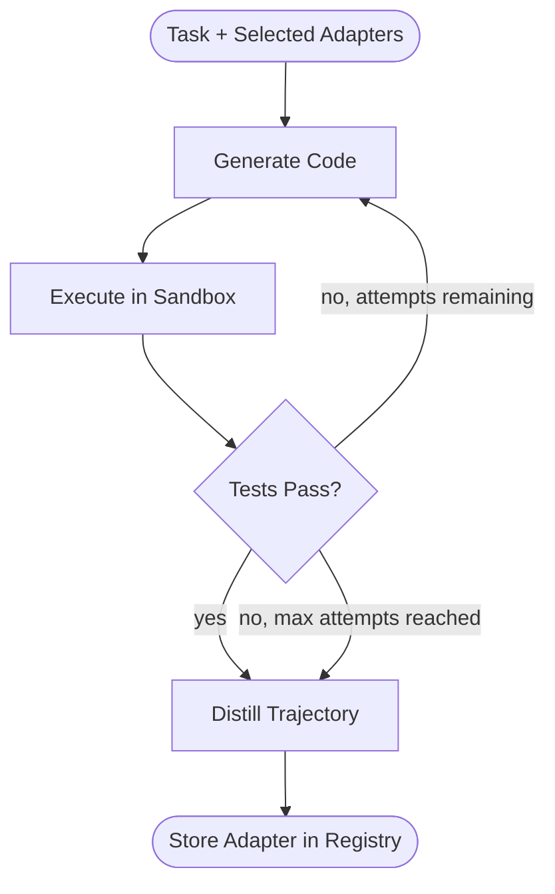

# Recursive Code Generation Loop

## Overview

The recursive loop is Rune's central execution mechanism: a task enters, code is generated, executed, evaluated, and — if tests fail — the trajectory feeds back into generation. When the loop terminates (tests pass or max attempts reached), the complete trajectory is distilled into a LoRA adapter. This document specifies the data flow at each step, retry logic, and termination conditions.

For the serving architecture that supports this loop, see [GPU Strategy](multi-gpu-strategy.md). For where the resulting adapters are stored, see [Adapter Storage](adapter-storage.md).

---

## Loop Architecture

---

## Step-by-Step Data Flow

### Step 1: Task Intake

| Field | Description |
|-------|-------------|
| **Input** | Task description, test suite, selected adapter IDs from registry |
| **Output** | Initialized agent state with loaded adapters |
| **Side effects** | Adapter router queries registry, loads best-match adapters into lora-server |

The adapter router queries the [adapter registry](adapter-storage.md) by task metadata (language, domain, task type) and selects the highest-fitness adapter at each hierarchy level. Selected adapters are loaded into the vLLM serving process via its dynamic LoRA API.

### Step 2: Generate

| Field | Description |
|-------|-------------|
| **Input** | Task description + trajectory so far (empty on first attempt) |
| **Output** | Generated code (candidate solution) |
| **Model** | Base SLM + loaded LoRA adapters, served via vLLM |

On the first attempt, the prompt contains only the task description and test signatures. On subsequent attempts, the prompt includes the full trajectory: prior code attempts, execution outputs, error messages, and reflection notes. The trajectory grows monotonically — nothing is discarded between attempts.

### Step 3: Execute

| Field | Description |
|-------|-------------|
| **Input** | Generated code + test suite |
| **Output** | Execution result: stdout, stderr, exit code, test results |
| **Environment** | Docker sandbox: network-isolated, memory-limited, CPU-limited |

The sandbox is a Docker container with no network access, read-only filesystem mounts (except the output directory), and strict resource limits. Agent-generated code cannot escape the container. The execution timeout is configurable per task but defaults to 30 seconds.

### Step 4: Reflect

| Field | Description |
|-------|-------------|
| **Input** | Execution result + current attempt count |
| **Output** | Decision: retry, distill-on-success, or distill-on-exhaustion |
| **Logic** | Tests pass -> distill. Tests fail AND attempts < max -> retry. Tests fail AND attempts >= max -> distill anyway. |

The reflect step appends the execution result to the trajectory and evaluates termination conditions. The trajectory record includes the attempt number, generated code, full execution output, and the pass/fail determination. This record is the input to distillation regardless of outcome.

### Step 5: Distill

| Field | Description |
|-------|-------------|
| **Input** | Complete trajectory (all attempts, all execution results) |
| **Output** | New LoRA adapter (`.safetensors` file) + metadata |
| **Method** | Direct LoRA fine-tuning (Phase 3) or Doc-to-LoRA hypernetwork forward pass (Phase 4) |

In Phase 3 (implementation plan), distillation uses direct LoRA fine-tuning: the trajectory is formatted as training data and a standard PEFT fine-tune produces the adapter. In Phase 4, the Doc-to-LoRA hypernetwork replaces this with a single forward pass — no gradient descent at inference time.

Both successful and failed trajectories are distilled. A failed trajectory (max attempts reached, tests still failing) may still encode useful partial knowledge — debugging patterns, error recognition, partial solutions. The adapter metadata records whether the source trajectory was successful.

### Step 6: Store

| Field | Description |
|-------|-------------|
| **Input** | New adapter file + metadata (task type, pass rate, trajectory outcome) |
| **Output** | Adapter registered in SQLite, `.safetensors` written to filesystem |
| **Policy** | Write-once: no existing adapter is overwritten. See [Adapter Storage](adapter-storage.md). |

---

## Retry and Termination

| Condition | Action | Trajectory State |
|-----------|--------|-----------------|
| Tests pass on attempt N | Terminate loop, distill | N attempts recorded, final attempt marked successful |
| Tests fail, attempt < max | Retry from Generate | Trajectory grows by one attempt |
| Tests fail, attempt = max | Terminate loop, distill | All attempts recorded, marked as exhausted |
| Sandbox timeout | Treat as test failure | Timeout recorded in trajectory |
| Sandbox crash (OOM, segfault) | Treat as test failure | Crash details recorded in trajectory |

The maximum attempt count is configurable. The default is 5 attempts. This cap prevents indefinite loops on tasks beyond the model's current capability while still allowing multi-step reasoning.

---

## Trajectory Schema

Each trajectory is a structured record passed to the distillation step:

| Field | Type | Description |
|-------|------|-------------|
| `task_id` | string | Unique task identifier |
| `task_description` | string | Natural language task description |
| `test_suite` | string | Test code used for evaluation |
| `attempts` | list | Ordered list of attempt records |
| `attempts[].code` | string | Generated code for this attempt |
| `attempts[].stdout` | string | Execution stdout |
| `attempts[].stderr` | string | Execution stderr |
| `attempts[].exit_code` | int | Process exit code |
| `attempts[].tests_passed` | bool | Whether all tests passed |
| `outcome` | enum | `success` or `exhausted` |
| `adapter_ids_loaded` | list | Adapters that were active during generation |

---

## Integration Points

- **Adapter Registry** ([Adapter Storage](adapter-storage.md)): Queried at task intake for adapter selection; written to at Store step
- **vLLM lora-server** ([GPU Strategy](multi-gpu-strategy.md)): Serves base model + adapters during Generate step
- **Sandbox**: Docker container managed by rune-agent, isolated from host
- **model-training lib**: Provides PEFT utilities for the distillation step
