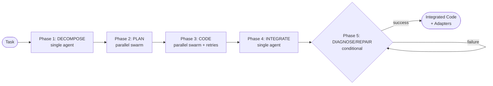

# 5-Phase Coding Pipeline

## Overview

Rune's execution model is a 5-phase sequential pipeline: decompose, plan, code, integrate, and diagnose/repair. Phases 2 and 3 run as parallel swarms; phases 1 and 4 run single-agent; phase 5 activates conditionally when code fails. Within each phase, a generate-execute-reflect loop iterates until tests pass or max attempts are reached. Each phase is driven by a Jinja2 template, optionally enhanced by a hypernetwork-generated LoRA adapter.

For swarm orchestration details, see [Swarm Architecture](../swarm-architecture.md). For adapter storage, see [Adapter Storage](adapter-storage.md).

---

## Pipeline Architecture



---

## Phase Details

### Phase 1: DECOMPOSE (single agent)

| Field | Description |
|-------|-------------|
| **Template** | `decompose.j2` (trajectory), `prompt_decompose.j2` (prompt) |
| **Input** | Project specification |
| **Output** | List of subtasks |
| **Adapter** | `decompose_adapter` (if available) |

Breaks a project specification into discrete subtasks. Runs once with the base model (+ optional adapter).

### Phase 2: PLAN (parallel swarm)

| Field | Description |
|-------|-------------|
| **Template** | `plan.j2` (trajectory), `prompt_plan.j2` (prompt) |
| **Input** | Project spec + one subtask per agent |
| **Output** | Architecture plan per subtask |
| **Adapter** | `plan_adapter` (if available) |

Each subtask is assigned to a swarm agent. All agents run in parallel. Each produces an architecture plan for its subtask.

### Phase 3: CODE (parallel swarm + retries)

| Field | Description |
|-------|-------------|
| **Template** | `code.j2` (first attempt), `code_retry.j2` (retries) |
| **Input** | Subtask + plan + prior code skeleton |
| **Output** | Working code per subtask |
| **Adapter** | `code_adapter` (if available), refreshed via H() between iterations |

The retry template (`code_retry.j2`) includes error summaries and attempt history. Between iterations, the hypernetwork H() can generate a fresh adapter from the accumulated trajectory. This is the primary phase where the recursive loop operates.

### Phase 4: INTEGRATE (single agent)

| Field | Description |
|-------|-------------|
| **Template** | `integrate.j2` (trajectory), `prompt_integrate.j2` (prompt) |
| **Input** | Project spec + all code outputs from Phase 3 |
| **Output** | Final integrated codebase |
| **Adapter** | `integrate_adapter` (if available) |

Merges all subtask code outputs into a coherent final codebase.

### Phase 5: DIAGNOSE/REPAIR (conditional)

| Field | Description |
|-------|-------------|
| **Template** | `diagnose.j2` (trajectory), `prompt_diagnose.j2` (prompt), `code_repair.j2` (trajectory), `prompt_code_repair.j2` (prompt) |
| **Input** | Failed code + error output from Phase 3 or Phase 4 |
| **Output** | Fixed code per subtask |
| **Adapter** | Domain adapter stays loaded; error context flows through prompt |

Activates when code fails during the retry loop. Uses a two-step pattern to avoid prompt-adapter tension where domain context and error details compete for model attention:

1. **Diagnose:** The error is placed in the prompt and the original code in the adapter trajectory. The model produces a concise fix instruction describing what went wrong and how to fix it.
2. **Repair:** The model's own diagnosis becomes the `fix_guidance` in the prompt, while domain context stays in the adapter. The model produces fixed code guided by its own analysis.

This separation keeps each inference call focused: diagnose concentrates on understanding the failure, repair concentrates on applying the fix with full domain context.

---

## Per-Phase Iteration

Each phase runs up to N iterations (configurable per phase via environment variables):

| Variable | Scope |
|----------|-------|
| `RUNE_MAX_PHASE_ITERATIONS` | Global default for all phases |
| `RUNE_MAX_ITERATIONS_DECOMPOSE` | Phase 1 override |
| `RUNE_MAX_ITERATIONS_PLAN` | Phase 2 override |
| `RUNE_MAX_ITERATIONS_CODE` | Phase 3 override |
| `RUNE_MAX_ITERATIONS_INTEGRATE` | Phase 4 override |
| `RUNE_MAX_ITERATIONS_REPAIR` | Phase 5 override (covers diagnose + repair + re-integrate steps) |

CLI flag `--max-phase-iterations` overrides the global env var. Hardcoded fallback is 5.

Within each iteration:
1. Render the Jinja2 trajectory template with current state
2. Optionally generate/refresh adapter via hypernetwork H()
3. Run inference (base model + adapter) to produce output
4. Execute output in sandbox, evaluate results
5. Score fitness; if passing or max iterations reached, stop

---

## Template System

All phase instructions flow through 18 Jinja2 templates in `libs/shared/src/shared/templates/`:

| Template | Phase | Purpose |
|----------|-------|---------|
| `decompose.j2` | 1 | Trajectory context for decomposition |
| `prompt_decompose.j2` | 1 | Model prompt for decomposition |
| `prompt_decompose_concise.j2` | 1 | Concise model prompt variant for decomposition |
| `plan.j2` | 2 | Trajectory context for planning |
| `prompt_plan.j2` | 2 | Model prompt for planning |
| `code.j2` | 3 | Trajectory context for first code attempt |
| `code_continue.j2` | 3 | Trajectory context for continuation |
| `code_retry.j2` | 3 | Trajectory context for retry (includes errors, history) |
| `prompt_code.j2` | 3 | Model prompt for code generation |
| `prompt_code_continue.j2` | 3 | Model prompt for code continuation |
| `prompt_code_retry.j2` | 3 | Model prompt for code retry |
| `integrate.j2` | 4 | Trajectory context for integration |
| `prompt_integrate.j2` | 4 | Model prompt for integration |
| `prompt_integrate_retry.j2` | 4 | Model prompt for integration retry |
| `diagnose.j2` | 5 | Trajectory context for failure diagnosis |
| `prompt_diagnose.j2` | 5 | Model prompt for diagnosis (error in prompt, code in adapter) |
| `code_repair.j2` | 5 | Trajectory context for targeted repair |
| `prompt_code_repair.j2` | 5 | Model prompt for repair (diagnosis becomes fix_guidance) |

Templates are rendered via `shared.template_loader.render_trajectory()` and `render_prompt()`.

---

## Sandbox

Code execution uses `shared.sandbox.SubprocessBackend` — a subprocess-based sandbox with configurable timeout. The sandbox runs agent-generated code in isolation and captures stdout, stderr, and exit code.

---

## Trajectory Schema

The trajectory flowing through the pipeline maps to `CodingSession` from `shared.rune_models`:

| Field | Type | Description |
|-------|------|-------------|
| `session_id` | str | Unique session identifier |
| `task_description` | str | Human-readable task description |
| `task_type` | str | Task category (e.g. 'bug-fix', 'feature-impl') |
| `adapter_refs` | list[AdapterRef] | Adapters loaded during this session |
| `attempt_count` | int | Number of generate-execute-reflect cycles |
| `outcome` | str or None | 'success', 'exhausted', or None if in progress |

---

## Integration Points

- **Adapter Registry** ([Adapter Storage](adapter-storage.md)): Queried at phase start for adapter selection; written to after adapter generation
- **Inference Providers** (`libs/inference`): TransformersProvider, LlamaCppProvider, OllamaProvider, or VLLMProvider — selected via factory
- **Sandbox** (`shared.sandbox.SubprocessBackend`): Executes generated code
- **Hypernetwork** (`model_training.hypernetwork.DocToLoraHypernetwork`): Generates adapters from trajectories
- **Swarm** (`scripts/swarm.py`): Orchestrates parallel execution of Phases 2 and 3

---

## Hypernetwork Training: Round-1 and Round-2 Distillation

The Sakana HyperLoRA hypernetwork (H) is trained in up to two rounds. The 5-phase pipeline above is the direct source of training signal: execution trajectories from decompose, plan, code, integrate, and diagnose phases are collected by `libs/corpus-producer` and binned by phase and benchmark into the oracle corpus used for training.

### Phase-to-Bin Mapping

Each of the 5 pipeline phases produces a distinct class of trajectory. `corpus_producer/trainer_bridge.py` bins these trajectories into 25 oracle bins: one bin per (phase, benchmark) pair for the 4 non-diagnose phases across 6 benchmarks, plus one pooled bin for diagnose trajectories across all benchmarks.

| Phase | Benchmarks | Bins produced |
|-------|------------|---------------|
| decompose | humaneval, mbpp, apps, bigcodebench, ds_1000, livecodebench | 6 |
| plan | humaneval, mbpp, apps, bigcodebench, ds_1000, livecodebench | 6 |
| code | humaneval, mbpp, apps, bigcodebench, ds_1000, livecodebench | 6 |
| integrate | humaneval, mbpp, apps, bigcodebench, ds_1000, livecodebench | 6 |
| diagnose | (pooled across all benchmarks) | 1 |
| **Total** | | **25** |

The oracle adapter for each bin is registered as `oracle_<bin_key>` where `bin_key` is `<phase>_<benchmark>` (e.g. `oracle_code_humaneval`) or `diagnose_pooled`.

### Round-1: Training Against the Base Model

Round-1 is the existing training path. The hypernetwork is trained using the base model (Qwen/Qwen3.5-9B) as the sole reference. No oracle adapters are required. The result is a hypernetwork that can generate task-specific LoRA adapters from trajectory documents alone.

Entry point: `scripts/train.sh` (wraps `libs/model-training/src/model_training/trainer_cli.py`).

### Round-2: Oracle-Teacher Distillation

Round-2 retrains the hypernetwork using the 25 per-bin oracle adapters as teacher signals rather than the bare base model. The objective is KL divergence + cross-entropy loss between the student forward pass (base model + hypernetwork-generated adapter) and the teacher forward pass (base model + oracle adapter). The result is a hypernetwork whose generated adapters are steered toward oracle-quality task specialisation.

Source modules:

| Module | Purpose |
|--------|---------|
| `libs/model-training/src/model_training/round2_config.py` | `Round2TrainConfig` (Pydantic, inherits `D2LTrainConfig`) |
| `libs/model-training/src/model_training/oracle_cache.py` | `OracleAdapterCache`, oracle lookup, coverage audit, `_load_oracle_as_lora_dict` |
| `libs/model-training/src/model_training/round2_train.py` | Training loop, functional-LoRA application, KL+CE loss, adapter registration |
| `libs/model-training/src/model_training/round2_gate.py` | `evaluate_round2_gate` — strict success gate |
| `scripts/train_round2.py` | Training CLI (exposes every `Round2TrainConfig` field) |
| `scripts/evaluate_round2.py` | Success-gate CLI; exits `0` on PASS, `1` on FAIL |

#### Round2TrainConfig

`Round2TrainConfig` inherits all fields from `D2LTrainConfig` and adds:

| Field | Default | Purpose |
|-------|---------|---------|
| `oracle_registry_url: str` | *(required)* | SQLAlchemy URL for the `AdapterRegistry` holding the 25 oracle records |
| `max_loaded_oracles: int` | `4` | LRU cap for `OracleAdapterCache` |
| `min_oracle_coverage: float` | `0.8` | Minimum fraction of training records whose bin has a registered oracle; below this → abort at startup |
| `oracle_fallback: Literal["base_model", "skip"]` | `"skip"` | Behaviour when a record's bin has no registered oracle |
| `checkpoint_dir: str` | `"./checkpoints/round2"` | Overrides parent so round-2 does not clobber round-1 checkpoints |
| `experiment_name: str` | `"d2l-qwen3-round2"` | Overrides parent for MLflow separation |

#### Functional-LoRA Teacher Mechanism

The oracle adapter is applied to the base model via the `apply_functional_lora` context manager — the same mechanism used for the student pass. The base model is **never structurally mutated**: no `PeftModel` wrappers are attached and no `LoraLayer` replacements are made. This eliminates PEFT hook-leakage risk between teacher and student forward passes.

Both teacher and student use the identical code path:

```
with apply_functional_lora(base_model, oracle_lora_dict):
    teacher_logits = base_model(input_ids, ...)

with apply_functional_lora(base_model, student_lora_dict):
    student_logits = base_model(input_ids, ...)
```

#### OracleAdapterCache

`OracleAdapterCache` holds oracle adapters as `LoraDict` tensor dicts rather than `PeftModel` wrappers:

```
LoraDict = {module: {"A": Tensor[L, r, in], "B": Tensor[L, r, out]}}
```

`_load_oracle_as_lora_dict` parses a PEFT safetensors checkpoint using the regex:

```
(?:base_model\.model\.)?model\.layers\.<L>\..*?\.<module>_proj\.lora_<A|B>\.weight
```

and stacks per-layer tensors across `hc.layer_indices`. The cache is LRU-bounded at `max_loaded_oracles=4` (default).

#### Oracle and Round-2 Adapter ID Schemes

- **Oracle adapters:** `oracle_<bin_key>` — set upstream by `libs/corpus-producer/src/corpus_producer/trainer_bridge.py`.
- **Round-2 adapters:** `round2_<uuid[:8]>` — registered by `round2_train.register_round2_adapter` with `task_type="round2_hypernet"`, `generation=2`, and `parent_ids=json.dumps(sorted(oracle_ids))` for lineage tracking.

#### Startup Guards

Two guards fire before any model is loaded:

1. **Coverage gate:** if the fraction of training records with a registered oracle bin falls below `min_oracle_coverage` (default `0.8`), training aborts with `RuntimeError`. `dry_run=True` surfaces this gate without running training, so operators can diagnose coverage gaps cheaply.

2. **Per-step skip sentinel:** `_training_step_round2` returns `(None, {})` when a record's bin has no oracle and `oracle_fallback == "skip"`. The outer training loop calls `continue` on that sentinel — `steps_completed` only advances on successful optimizer steps. Under `oracle_fallback="base_model"` (ablation mode), the bare base model is used as the teacher instead.

#### Strict Success Gate

`round2_gate.evaluate_round2_gate(scores) -> report` applies the following bar after training completes:

- **Pass condition:** ≥ 4 of 6 benchmarks improved by ≥ 2.0% Pass@1 **AND** no single benchmark regresses by more than 1.0%.
- **Required benchmarks:** `humaneval`, `mbpp`, `apps`, `bigcodebench`, `ds_1000`, `livecodebench`.
- **Verdict JSON keys:** `passed`, `deltas`, `improved_count`, `max_regression`, `reasons`, `round2_adapter_id`, `scores`.

`scripts/evaluate_round2.py` runs all 6 benchmarks, applies the gate, writes the verdict JSON, and exits `0` on PASS or `1` on FAIL so CI can gate promotion.

#### End-to-End Flow

```bash
# 1. Produce 25-bin oracle corpus (multi-GPU via gap-8 sharding)
for i in 0 1 2 3; do
    uv run scripts/phase_corpus_producer.py \
        --shard $i/4 --cuda-visible-devices $i \
        --out-dir data/phase_corpus &
done
wait

# 2. Train round-1 hypernet + capture baseline benchmark report
uv run scripts/train.sh
# ... run 6 benchmarks → round1_scores.json

# 3. Train round-2 hypernet with oracle teachers
uv run scripts/train_round2.py \
    --sakana-checkpoint-path /path/to/sakana.bin \
    --oracle-registry-url sqlite:///~/.rune/adapters.db \
    --dataset-path data/phase_corpus/all_bins_concat.jsonl \
    --num-steps 1000 \
    --kill-switch-enabled

# 4. Apply the strict gate
uv run scripts/evaluate_round2.py \
    --round2-adapter-id round2_<hex8> \
    --base-model Qwen/Qwen3.5-9B \
    --oracle-registry-url sqlite:///~/.rune/adapters.db \
    --baseline-report round1_scores.json \
    --output-report round2_verdict.json
# Exit 0 → gate passed; exit 1 → regression or insufficient improvement
```
