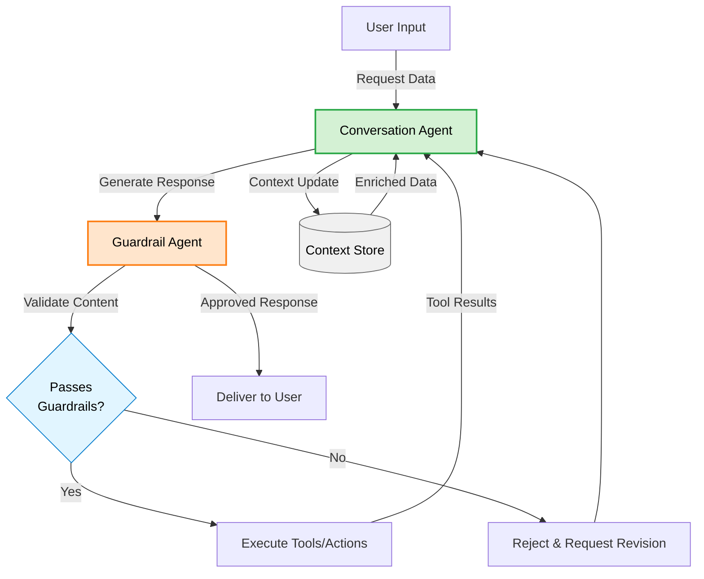

# Agent Flow

```mermaid
graph TD
    User[User Input] -->|Request Data| ConvAgent[Conversation Agent]
    ConvAgent -->|Generate Response| Guard[Guardrail Agent]
    Guard -->|Validate Content| Decision{Passes<br/>Guardrails?}
    Decision -->|Yes| Tools[Execute Tools/Actions]
    Decision -->|No| Reject[Reject & Request Revision]
    Reject --> ConvAgent
    Tools -->|Tool Results| ConvAgent
    ConvAgent -->|Context Update| Context[(Context Store)]
    Context -->|Enriched Data| ConvAgent
    Guard -->|Approved Response| Output[Deliver to User]

    classDef agent fill:#d4f1d4,stroke:#28a745,color:#000,stroke-width:2px;
    classDef guard fill:#ffe5cc,stroke:#fd7e14,color:#000,stroke-width:2px;
    classDef decision fill:#e1f5ff,stroke:#007acc,color:#000;
    classDef data fill:#f0f0f0,stroke:#666,color:#000;

    class ConvAgent agent;
    class Guard guard;
    class Decision decision;
    class Context data;
```
