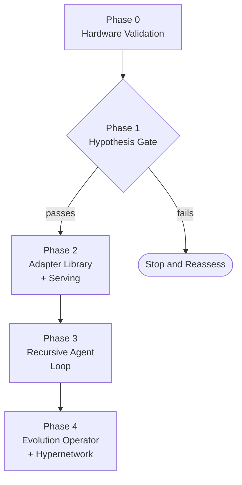

# Rune Implementation Plan

## Executive Summary

Rune proposes to validate and implement a system that encodes coding trajectories into LoRA adapters using a Doc-to-LoRA hypernetwork, accumulating parametric memory that persists across sessions. This plan covers the full journey from hardware validation through hypernetwork training across five implementation phases (Phase 0 through Phase 4), structured so that the core hypothesis is validated before infrastructure is built.

### Phase Overview

| Phase | Goal | Gate |
|-------|------|------|
| Phase 0 | Hardware and environment validation | Precondition (all binary pass/fail) |
| Phase 1 | Core hypothesis validation — Doc-to-LoRA on coding tasks | **Kill-switch** (5% Pass@1 threshold) |
| Phase 2 | Adapter library and serving infrastructure | Success criteria (checklist + metrics) |
| Phase 3 | Recursive agent loop and sandbox integration | Success criteria (checklists) |
| Phase 4 | Evolution operator and hypernetwork | Success criteria (metrics + checklists) |

### Key Risks

Three primary research risks are tracked throughout this plan. See [Risk Matrix](appendices/risk-matrix.md) for full mitigation strategies and warning signs.

- **Hypernetwork mode collapse** — The degenerate solution (mean adapter) has near-zero variance across inputs; diversity regularization in the training loss is required from the start.
- **Adapter composition interference** — Direct additive merging of heterogeneous LoRAs produces interference in non-orthogonal subspaces; default to single-adapter retrieval.
- **Catastrophic forgetting** — Adapter registry must enforce write-once semantics; no code path may overwrite an existing adapter.

### Build Order

The recommended component build sequence is detailed in [Build Order](appendices/build-order.md). The dependency root is `libs/adapter-registry` — it must be built first, as all other components depend on it for adapter storage and retrieval.

### Phase Dependency Graph

### Research-Stage Framing

This plan is structured for a research-stage system: the phases after the kill-switch gate (Phase 2 through Phase 4) are contingent on the hypothesis validated in Phase 1. Writing them out does not imply confidence that they will be reached — it means the design is complete enough to proceed if the hypothesis holds. If Phase 1 fails, the plan does not prescribe a pivot. The failure itself is informative and narrows the design space.

---

## Phase 0: Hardware and Environment Validation

**Depends on:** Nothing — this is the first phase.

Phase 0 confirms that the hardware and software environment is ready for GPU-dependent work. This is a precondition gate, not a research gate: none of the hypothesis testing in Phase 1 is possible without a validated environment. The success criteria are entirely binary — each check either passes or fails, with no partial credit.

### Why This Phase Comes First

GPU-dependent workloads fail in hardware-specific, non-obvious ways: CUDA version mismatches cause segfaults during backward passes, vLLM may require compilation from source for newer pipeline-parallelism features, and the TP+LoRA corruption bug (vLLM issue #21471) can produce silently wrong outputs rather than crashes. Discovering any of these mid-experiment invalidates results and forces a debugging detour. Phase 0 establishes a clean baseline before any research work begins.

The distinction between Phase 0 and an installation guide is intentional. Phase 0 validates that the environment works correctly — the pass/fail tests confirm behavior, not installation. The steps required to achieve a passing environment (installing drivers, compiling vLLM, configuring CUDA paths) are pre-conditions that precede this phase.

### Hardware Constraints

| Component | Specification |
|-----------|---------------|
| GPU | 2x NVIDIA RTX 4090 (Ada Lovelace, sm_89), 24 GB VRAM each, 48 GB total |
| GPU Interconnect | CXL (cache-coherent memory pooling) |
| Multi-GPU Strategy | Pipeline parallelism: `--pipeline-parallel-size 2 --tensor-parallel-size 1` |
| CUDA | 12.8+ (cu128) |
| PyTorch | 2.9+ (nightly, cu128 wheels) |
| Quantization toolchain | PEFT + bitsandbytes (QLoRA, NF4 4-bit) |

**Note on tensor parallelism:** `--tensor-parallel-size 2` is explicitly excluded. All-reduce operations over PCIe (~32 GB/s) are prohibitively expensive compared to NVLink (~112 GB/s per direction). Pipeline parallelism passes activations only at layer boundaries and is the correct strategy for this interconnect. The TP+LoRA corruption bug (vLLM #21471) applies to this hardware configuration and is confirmed absent under PP=2.

### Deliverables

- [ ] Both RTX 4090 GPUs recognized by CUDA (`nvidia-smi` lists both; `torch.cuda.device_count() == 2`)
- [ ] PyTorch nightly cu128 forward pass and backward pass complete without segfault on both GPUs
- [ ] vLLM serves Qwen2.5-Coder-7B-Instruct with `--pipeline-parallel-size 2 --tensor-parallel-size 1` without crash
- [ ] vLLM serves a known-good LoRA adapter and produces correct output (regression test confirming TP+LoRA corruption is absent under PP=2)
- [ ] PEFT + bitsandbytes QLoRA fine-tune runs 1 training step without error (confirming quantization toolchain is functional)

### Risk Callouts

> **Driver/CUDA version mismatch:** PyTorch nightly cu128 requires CUDA 12.8+. Mismatched driver and toolkit versions produce cryptic errors at import time or during the first CUDA operation. Verify `nvidia-smi` reports CUDA 12.8+ and that `torch.version.cuda` matches.

> **vLLM build from source:** Depending on the vLLM release at execution time, pipeline-parallel-size 2 support may require building vLLM from source. Confirm the installed vLLM version supports PP=2 before running the serving validation step.

### Success Criteria

| Criterion | Type | Target |
|-----------|------|--------|
| Both GPUs recognized by CUDA | Checklist | Pass (both in `nvidia-smi`; `device_count() == 2`) |
| PyTorch forward+backward pass without segfault | Checklist | Pass (both GPUs) |
| vLLM PP=2 serving without crash | Checklist | Pass |
| TP+LoRA corruption absent under PP=2 | Checklist | Pass (known-good adapter produces correct output) |
| QLoRA 1-step fine-tune without error | Checklist | Pass |

---

## Phase 1: Core Hypothesis Validation (Kill-Switch Gate)

**Depends on:** Phase 0 passes all success criteria.

Phase 1 tests the central hypothesis empirically: can a Doc-to-LoRA hypernetwork encode coding trajectories into LoRA adapters that improve task performance over the base model? No infrastructure is built until this gate passes. The rationale for this sequencing is that the adapter registry, serving layer, and recursive agent loop are all contingent on the hypothesis holding — building them before validation would be premature optimization of infrastructure around an unvalidated core idea.

### Why This Phase Comes Before Infrastructure

The infrastructure-first instinct — build the registry, the serving layer, the agent loop, then test the hypothesis — is common and historically problematic. Building infrastructure before validating the core idea embeds assumptions into architecture that are difficult to reverse if the idea fails. The study of failed ML projects (RAND 2024) consistently identifies premature infrastructure investment as a compounding failure mode: teams that discover a hypothesis failure late have also accumulated technical debt in systems that depend on it.

Rune's kill-switch gate is the operational expression of hypothesis-first ordering: Phase 2 through Phase 4 are real and detailed, but they are explicitly conditional. Passing Phase 1 is what makes them worth building.

### Deliverables

- [ ] Minimal Doc-to-LoRA hypernetwork trained on 50-100 coding trajectory pairs (one trajectory per task: task description, attempt sequence, final passing code)
- [ ] Adapter quality evaluation on held-out HumanEval subset (20-30 tasks, 5 samples per task)
- [ ] MLflow run documenting: Pass@1 vs baseline, training loss curve, adapter cosine diversity across training batch, `||ΔW||` norms
- [ ] Written assessment: what passed, what failed, what was learned — regardless of whether the gate passes or fails

### Kill-Switch

> **Primary metric:** Pass@1 improvement of ≥ 5% on held-out HumanEval tasks (20-30 task subset) compared to Qwen2.5-Coder-7B-Instruct baseline with no adapter.
>
> **If the gate passes:** The hypothesis has empirical support — not proof, but support. Proceed to Phase 2. The architectural decisions made in Phases 2 through 4 are now worth acting on.
>
> **If the gate fails:** Stop and document what was learned. There is no predefined fallback strategy. The failure narrows the design space — it is a research finding, not a project failure. The specific failure mode (mode collapse, no adapter transfer, training instability, insufficient trajectory signal) determines what comes next. Prescribing a fallback now would be speculative.

**Hardware note for Phase 1:** Run the baseline in bfloat16 — not QLoRA. This isolates the hypothesis variable (does Doc-to-LoRA on coding trajectories work?) from the quantization variable (does NF4 quantization degrade adapter quality?). QLoRA is introduced in Phase 2 after the bfloat16 baseline passes.

### Secondary Diagnostic Signals

These are tracked via MLflow and inform the written assessment, but do not gate the kill-switch decision:

- Adapter cosine diversity > 0.1 across training batch (early signal for mode collapse — if adapters are clustering, the hypernetwork is collapsing to the mean)
- Training loss converges and does not plateau in the first 5% of the budget (training is learning, not stuck)
- `||ΔW||` is meaningfully nonzero (the adapter is affecting the base model's behavior, not being ignored)

### Risk Callouts

> **Hypernetwork mode collapse** (see [Risk Matrix](appendices/risk-matrix.md)): The hypernetwork may learn to produce near-identical adapters regardless of input trajectory — the degenerate solution. Diversity regularization in the training loss and monitoring of cosine diversity are the primary mitigations. If diversity collapses during Phase 1, the gate will fail (Pass@1 will not improve across different task types), but the diagnostic signals should identify the failure mode before the full evaluation.

> **Training data quality:** Trajectories must be diverse in task type, failure mode, and correction pattern. A dataset of 50-100 nearly-identical trajectories (e.g., all variations on the same task) will produce mode collapse regardless of architecture. Verify trajectory diversity before training begins.

### Success Criteria

| Criterion | Type | Target |
|-----------|------|--------|
| Pass@1 improvement on held-out HumanEval subset | **Kill-switch metric** | ≥ 5% over baseline |
| MLflow run with required metrics logged | Checklist | Pass |
| Written assessment produced | Checklist | Pass |
| Adapter cosine diversity monitored | Checklist | Pass (tracked; not a gate) |

### Experiment Sketch

**Dataset:** 50-100 real coding trajectory pairs from HumanEval or SWE-bench-lite. Each trajectory consists of: task description, attempt sequence (code + error messages + corrections), final passing code. Trajectories sourced from existing evaluation runs or synthetically generated via a prompted base model.

**Baseline:** Qwen2.5-Coder-7B-Instruct with no adapter — raw model Pass@1 on the held-out task subset (5 samples per task, bfloat16, PP=2 serving).

**Evaluation method:** Pass@1 on 20-30 held-out HumanEval tasks. Five samples per task. Tasks held out from the training trajectory corpus to test generalization, not memorization.

**Expected range:** 5-15% improvement over baseline signals a real effect and passes the gate. Less than 5% = gate fails. Greater than 15% should be treated skeptically and checked against the secondary diagnostics for data leakage.

**Tracking:** MLflow experiment with schema: `run_id`, `phase`, `adapter_id`, `pass_at_1`, `training_loss`, `adapter_cosine_diversity`, `delta_w_norm`. Gate decision recorded as an MLflow run note: `"Gate PASSED"` or `"Gate FAILED — reassessing"`.

---

## Phase 2: Adapter Library and Serving Infrastructure

**Depends on:** Phase 1 kill-switch passes.

Assuming Phase 1 validates the core hypothesis, Phase 2 builds the component foundation: the adapter registry, vLLM serving with dynamic LoRA loading, API extensions, and QLoRA integration. These components are the dependency roots of the [build order](appendices/build-order.md) — every subsequent phase depends on them.

### Why This Phase Comes Here

The adapter registry (`libs/adapter-registry`) is the foundation of the entire system: every component that stores or retrieves adapters depends on it. The vLLM lora-server (`services/lora-server`) unblocks all agent work and hypothesis testing. Building these before Phase 3 or Phase 4 would have been premature if Phase 1 had failed — infrastructure built around an unvalidated hypothesis is wasted work. With Phase 1 passing, these components are now justified.

QLoRA is introduced in this phase (not Phase 1) to isolate variables. The Phase 1 baseline established that the hypernetwork approach works in bfloat16. Phase 2 adds quantization and verifies that the quality loss is acceptable (<10% Pass@1 degradation) — a distinct measurement from the core hypothesis.

### Deliverables

- [ ] `libs/adapter-registry`: SQLModel schema, write-once enforcement at the storage API level, `.safetensors` path resolution, adapter metadata queryable without loading weights into GPU memory
- [ ] `services/lora-server`: vLLM Dockerfile, startup script (`PP=2, TP=1, --enable-lora`), dynamic LoRA loading via vLLM's adapter API, health check endpoint
- [ ] `services/api-service` extensions: `/adapters` and `/sessions` routes, SQLModel tables, REST interface for adapter registry queries
- [ ] QLoRA integration: bfloat16 baseline → NF4 QLoRA transition with quality comparison logged to MLflow

### Risk Callouts

> **Adapter composition interference** (see [Risk Matrix](appendices/risk-matrix.md)): Default to single-adapter retrieval at inference time. Multi-adapter composition (additive merging of heterogeneous LoRAs) is an optional future experiment, not the default architecture. The risk of interference in non-orthogonal weight subspaces is real; the single-adapter default avoids it.

> **Catastrophic forgetting** (see [Risk Matrix](appendices/risk-matrix.md)): Write-once semantics must be enforced at the registry API level, not as a convention. No code path may overwrite an existing adapter. Adapters are indexed by session ID and timestamp — if a new adapter is produced for the same task, it is a new entry, not an update.

### Success Criteria

| Criterion | Type | Target |
|-----------|------|--------|
| Adapter registry stores and retrieves by session ID and metadata | Checklist | Pass |
| Write-once semantics enforced (no overwrite code path exists) | Checklist | Pass |
| vLLM lora-server starts and serves with dynamic LoRA loading | Checklist | Pass |
| No `--tensor-parallel-size 2` flag anywhere in config | Checklist | Pass |
| QLoRA Pass@1 vs bfloat16 baseline degradation | Metric | < 10% degradation (logged in MLflow) |

### Experiment Sketch

**Dataset:** Same held-out HumanEval subset used in Phase 1 (20-30 tasks, 5 samples per task).

**Baseline:** Phase 1 bfloat16 Pass@1 (already logged in MLflow).

**Evaluation method:** Run the same held-out tasks with the Phase 1 adapter loaded into the Phase 2 vLLM lora-server, served in NF4 QLoRA mode. Compare Pass@1 between bfloat16 (Phase 1) and NF4 QLoRA (Phase 2).

**Expected range:** < 10% degradation is acceptable and consistent with QLoRA paper results. Greater than 10% suggests quantization artifacts beyond expected range — investigate NF4 configuration before proceeding.

---

## Phase 3: Recursive Agent Loop and Sandbox Integration

**Depends on:** Phase 2 success criteria met.

Contingent on Phase 2 delivering a functional adapter registry and serving layer, Phase 3 builds the core agent loop (`services/rune-agent`) and the sandboxed code execution environment. This phase produces the first end-to-end path from task to adapter — the complete recursive loop described in the architecture.

### Why This Phase Comes Here

Phase 3 depends on Phase 2 at three integration points: the agent needs the adapter registry to select adapters at session start, the lora-server to load and serve them, and the api-service extensions to query and store session state. Without Phase 2, the agent loop has nowhere to retrieve or store adapters. Building the agent loop before the serving infrastructure would require mocking the entire adapter layer — wasted work that needs to be undone.

Phase 3 also produces the adapter corpus required by Phase 4. The hypernetwork training job requires 50-100 diverse task-adapter pairs. The recursive agent loop is the mechanism that generates these pairs at scale. Phase 4 cannot begin until Phase 3 has produced sufficient corpus.

### Deliverables

- [ ] `services/rune-agent`: LangGraph `StateGraph` implementing `generate → execute → reflect → save` cycle, with configurable maximum attempt count
- [ ] Sandbox: Docker-based code execution with network isolation, memory limits, and CPU limits; agent operates outside the container
- [ ] Adapter selection: query adapter-registry at session start, load most-relevant adapter into lora-server based on task metadata
- [ ] `libs/model-training` extensions: PEFT utilities, trajectory-to-adapter fine-tuning script (direct LoRA fine-tuning path, distinct from hypernetwork inference)
- [ ] End-to-end test: task → agent loop → successful code → trajectory captured → passed to distillation → adapter stored in registry

### Risk Callouts

> **Sandbox escape:** Agent-generated code must not be able to reach the host network, host filesystem (outside the designated output directory), or other containers. Network isolation and read-only mounts are required from the first implementation — not added later as a hardening step.

> **Agent loop divergence:** The generate-execute-reflect cycle requires a maximum attempt count. Without a hard stop, the loop retries indefinitely on tasks that are outside the model's current capability. The trajectory is still captured on loop termination (even without a passing solution) — a failed-but-attempted trajectory may still produce a useful adapter.

### Success Criteria

| Criterion | Type | Target |
|-----------|------|--------|
| Agent loop completes generate → execute → reflect → save cycle | Checklist | Pass |
| Sandbox network isolation verified | Checklist | Pass (no outbound connections from container) |
| Adapter selection queries registry and loads adapter | Checklist | Pass |
| End-to-end test passes (task → adapter stored in registry) | Checklist | Pass |
| Trajectory-to-adapter fine-tuning script produces loadable adapter | Checklist | Pass |

---

## Phase 4: Evolution Operator and Hypernetwork

**Depends on:** Phase 3 success criteria met AND adapter corpus of 50-100 diverse task-adapter pairs accumulated from Phase 3 runs.

Contingent on Phase 3 delivering a functional recursive agent loop, Phase 4 builds the adapter lifecycle management system (`services/evolution-svc`) and the Doc-to-LoRA hypernetwork inference path (`services/training-svc` hypernetwork job). This is the final phase and closes the loop: adapters produced by Phase 3 train the hypernetwork that generates future adapters.

### Why This Phase Comes Last

The hypernetwork requires a corpus of pre-trained adapters as training data — a cold-start problem that cannot be bypassed. Without Phase 3 producing diverse task-adapter pairs, the hypernetwork has nothing to train on. The evolution operator (`services/evolution-svc`) also depends on a populated adapter registry: fitness evaluation requires existing adapters to compare and promote.

Attempting to build Phase 4 before Phase 3 is complete would require synthetic adapter data, which may not reflect the distribution of real coding task adapters. The ordering is forced by the data dependency.

### Deliverables

- [ ] `services/evolution-svc`: fitness evaluation against held-out test sets, tournament selection, adapter pruning below fitness threshold, promotion of high-performing adapters in the hierarchy
- [ ] `services/training-svc`: hypernetwork training job (trains on Phase 3 adapter corpus), hypernetwork inference path (single forward pass → adapter weights, without gradient descent)
- [ ] Adapter hierarchy: project-root, domain, and task-specific levels populated by the evolution operator from Phase 3 adapters
- [ ] MLflow tracking: adapter fitness scores per evaluation run, evolution events (promotions, prunings, merges), hypernetwork reconstruction loss on held-out adapters

### Risk Callouts

> **Hypernetwork mode collapse** (see [Risk Matrix](appendices/risk-matrix.md)): Diversity regularization must be in the training loss from the start of hypernetwork training. Monitor adapter cosine diversity at each checkpoint — if it falls below the threshold (< 0.1), stop training and investigate. The Phase 1 experiment will have provided a reference baseline for what healthy cosine diversity looks like.

> **Minimum corpus size:** The hypernetwork training requires a diverse adapter corpus. Diversity here is over task types, failure modes, and correction patterns — not just adapter count. If the Phase 3 corpus lacks sufficient diversity (e.g., all adapters trained on similar tasks), delay hypernetwork training and continue accumulating adapters from a wider task distribution. The Phase 3 end-to-end test verifies individual adapters; this is a separate concern about corpus-level diversity.

### Success Criteria

| Criterion | Type | Target |
|-----------|------|--------|
| Hypernetwork reconstruction loss on held-out adapters | Metric | Below baseline (random adapter) |
| Adapter cosine diversity on hypernetwork outputs | Metric | > 0.1 threshold |
| Evolution operator promotes, prunes, archives without corrupting registry | Checklist | Pass |
| Hypernetwork-generated adapters load and run in vLLM without error | Checklist | Pass |
| Hypernetwork-generated adapter Pass@1 vs direct fine-tuned adapter Pass@1 | Metric | Logged in MLflow (directional comparison, not a gate) |

### Experiment Sketch

**Dataset:** Held-out adapter subset from Phase 3 corpus (10-20% withheld from hypernetwork training set).

**Baseline:** Random adapter (Gaussian weight initialization at the same rank) as reconstruction loss reference; direct fine-tuned adapter Pass@1 as inference quality reference.

**Evaluation method:** Reconstruction loss (MSE between hypernetwork-generated adapter weights and held-out fine-tuned adapter weights); cosine diversity across a batch of hypernetwork-generated adapters; Pass@1 comparison on held-out HumanEval tasks using hypernetwork-generated vs fine-tuned adapters.

**Expected range:** Reconstruction loss below random baseline confirms the hypernetwork is learning the adapter manifold. Cosine diversity > 0.1 confirms diversity is preserved. Pass@1 parity with fine-tuned adapters (±5%) would be a strong result; 50-80% of fine-tuned adapter quality is the expected range for a first-pass hypernetwork.

---

## References

[1] Charakorn et al., "Doc-to-LoRA: Learning to Instantly Internalize Contexts," arXiv:2602.15902, 2026. https://arxiv.org/abs/2602.15902

[2] Sheng et al., "S-LoRA: Serving Thousands of Concurrent LoRA Adapters," arXiv:2311.03285, 2023. https://arxiv.org/abs/2311.03285

[3] Dettmers et al., "QLoRA: Efficient Finetuning of Quantized LLMs," arXiv:2305.14314, 2023. https://arxiv.org/abs/2305.14314

**Appendices:**

- [Risk Matrix](appendices/risk-matrix.md) — Primary research risks, mitigations, and warning signs
- [Build Order](appendices/build-order.md) — Component dependency chain and recommended build sequence

**Project documentation:**

- README.md (repository root) — Architecture overview, hardware specification, and theoretical grounding
