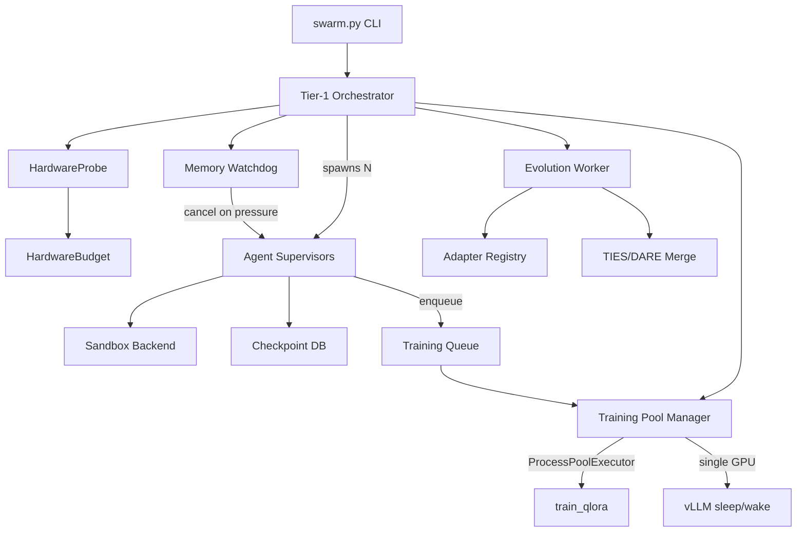

# Swarm Architecture

## Overview

The swarm execution system collapses Rune's microservice architecture into a single-process "fat orchestrator" for local hardware. It coordinates multiple agents, training workers, and an evolution loop via `asyncio.TaskGroup`.

## Architecture Diagram

## Components

| Component | Location | Role |
|-----------|----------|------|
| HardwareProbe | `libs/shared/src/shared/hardware.py` | Detect CPU, RAM, GPU resources |
| SandboxBackend | `libs/shared/src/shared/sandbox.py` | Execute code safely (subprocess/nsjail) |
| SwarmCheckpointDB | `libs/shared/src/shared/checkpoint_db.py` | Track task execution state |
| AdapterRegistry | `libs/adapter-registry/` | Store and query adapter metadata |
| Training Pool | `scripts/swarm_workers.py` | Manage concurrent training jobs |
| Evolution Worker | `scripts/swarm_evolution.py` | Periodic merge + prune sweeps |
| Swarm Orchestrator | `scripts/swarm.py` | Top-level coordinator |

## GPU Time-Sharing

In single-GPU mode, the training pool manager coordinates with vLLM:

1. **Sleep** — POST `/sleep` to release GPU memory
2. **Train** — Run QLoRA training in subprocess
3. **Wake** — POST `/wake_up` to reclaim GPU memory

Multi-GPU mode skips sleep/wake and uses dedicated GPUs.

## Evolution Strategy

Every `evolution_interval` seconds:

1. For each task type with ≥5 adapters, TIES-merge the top 3
2. Archive any adapter with fitness < 0.3
3. New merged adapters inherit `generation = max(parents) + 1`
