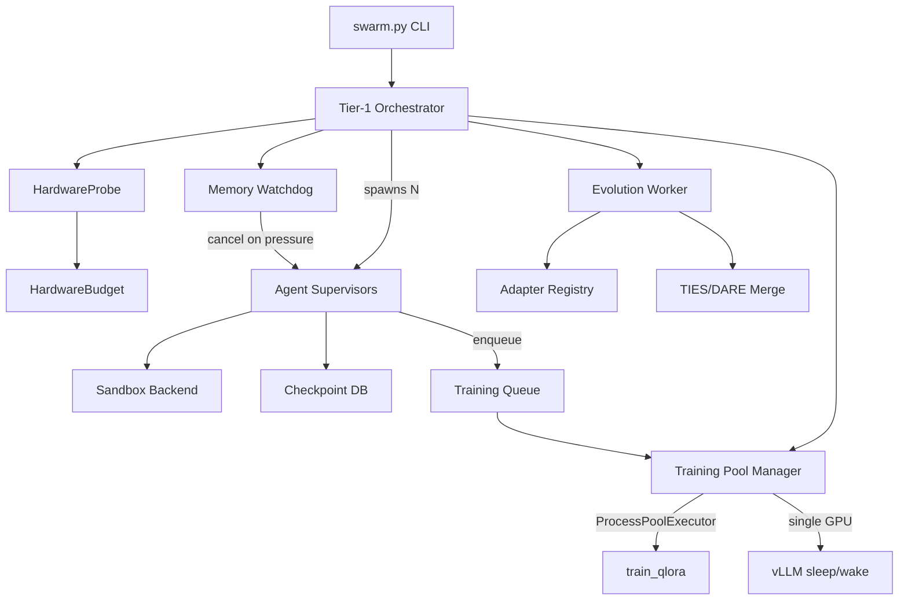

# Swarm Architecture

## Overview

The swarm execution system collapses Rune's microservice architecture into a single-process "fat orchestrator" for local hardware. It coordinates multiple agents, training workers, and an evolution loop via `asyncio.TaskGroup`.

## Architecture Diagram

## Components

| Component | Location | Role |
|-----------|----------|------|
| HardwareProbe | `libs/shared/src/shared/hardware.py` | Detect CPU, RAM, GPU resources |
| SandboxBackend | `libs/shared/src/shared/sandbox.py` | Execute code safely (subprocess/nsjail) |
| SwarmCheckpointDB | `libs/shared/src/shared/checkpoint_db.py` | Track task execution state |
| AdapterRegistry | `libs/adapter-registry/` | Store and query adapter metadata |
| Training Pool | `scripts/swarm_workers.py` | Manage concurrent training jobs |
| Evolution Worker | `scripts/swarm_evolution.py` | Periodic merge + prune sweeps |
| Swarm Orchestrator | `scripts/swarm.py` | Top-level coordinator |

## GPU Time-Sharing

In single-GPU mode, the training pool manager coordinates with vLLM:

1. **Sleep** — POST `/sleep` to release GPU memory
2. **Train** — Run QLoRA training in subprocess
3. **Wake** — POST `/wake_up` to reclaim GPU memory

Multi-GPU mode skips sleep/wake and uses dedicated GPUs.

## Evolution Strategy

Every `evolution_interval` seconds:

1. For each task type with ≥5 adapters, TIES-merge the top 3
2. Archive any adapter with fitness < 0.3
3. New merged adapters inherit `generation = max(parents) + 1`

## Swarm Evolution vs Round-2 Distillation

Swarm evolution and round-2 hypernetwork distillation are **two independent adapter lifecycle pipelines**. Do not confuse them:

| Pipeline | What it operates on | Mechanism | Output |
|----------|---------------------|-----------|--------|
| **Swarm evolution** (`scripts/swarm_evolution.py`) | Pools of task-level adapters accumulated in the registry | Fitness-based TIES / DARE merge + pruning | New merged adapter with `generation = max(parents) + 1` |
| **Round-2 distillation** (`scripts/train_round2.py`) | 25 per-bin oracle adapters as teacher signals | Functional-LoRA teacher + KL+CE loss training of the hypernetwork | New hypernetwork weights (`round2_<uuid[:8]>`, `task_type="round2_hypernet"`, `generation=2`) |

Swarm evolution composes existing adapters into better adapters. Round-2 distillation retrains the hypernetwork itself so that future single-pass generations are closer to oracle-quality. Round-2 depends on the oracle set produced by `libs/corpus-producer` (see `phase_corpus_producer.py`); swarm evolution operates on whatever adapters the swarm has accumulated from live execution.
